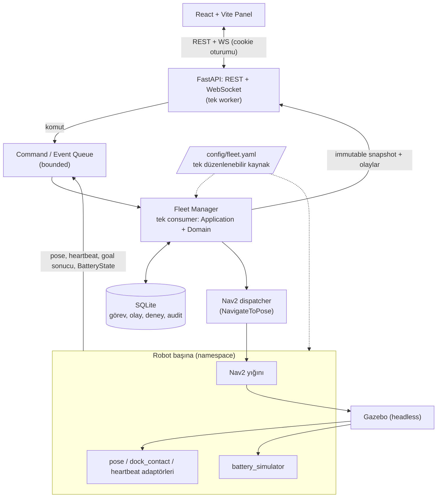
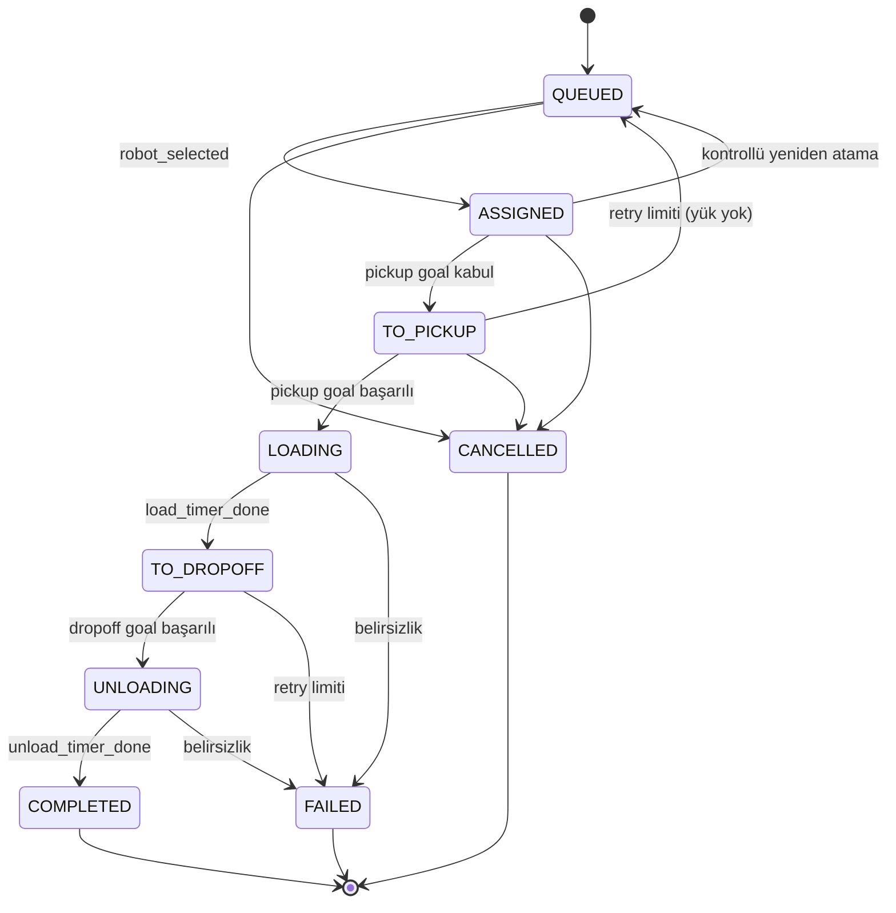
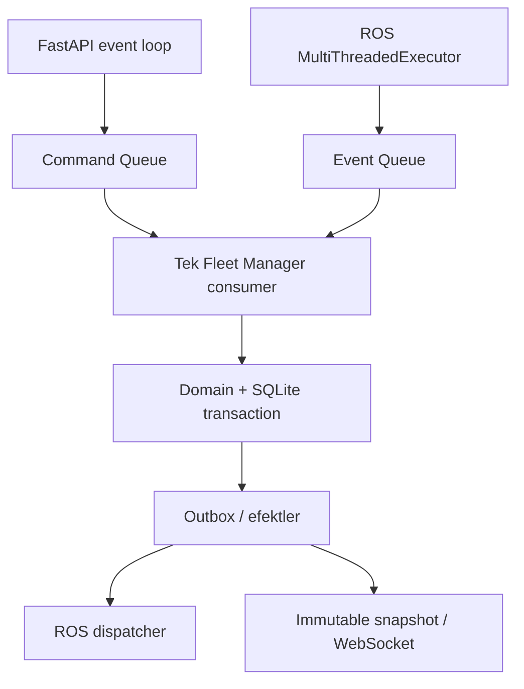

# ROS 2 Tabanlı Çok Robotlu Mini Filo Yönetim Sistemi

Simülasyon ortamında **config-driven**, **pickup → dropoff** görevli çok robotlu filo yönetimi ve web tabanlı izleme paneli.

| | |
|---|---|
| **Ders** | Yazılım Mühendisliği – Final Projesi |
| **Platform** | ROS 2 Humble · Nav2 · Gazebo (Ignition Fortress) · FastAPI · SQLite · React + Vite |
| **Mimari belge seti** | Fleet Manager **v2.2** · Config-Driven **v1.3** · Web Panel / WebSocket **v1.2** · Battery Simulator **v1.2** (kilitli) |
| **Tarih** | 9 Ekim 2026 |

> **Durum notu:** Bu README, kilitlenen mimari sözleşmeleri özetler. Mimari belgeler uygulama kodunun çalıştırılarak doğrulandığı anlamına gelmez. Eşikler ve katsayılar **örnektir**; deneylerle kalibre edilir. Bilinen açık noktalar için [20. bölüme](#20-açık-noktalar-uygulama-sırasında-netleştirilecekler) bakın.

---

## İçindekiler

1. [Proje Özeti](#1-proje-özeti)
2. [Hedefler ve Kapsam](#2-hedefler-ve-kapsam)
3. [Sistem Mimarisi](#3-sistem-mimarisi)
4. [Teknoloji Yığını](#4-teknoloji-yığını)
5. [Repo Yapısı](#5-repo-yapısı)
6. [Konfigürasyon (`fleet.yaml`)](#6-konfigürasyon-fleetyaml)
7. [Robot İzolasyonu, TF ve Dinamik Başlatma](#7-robot-i̇zolasyonu-tf-ve-dinamik-başlatma)
8. [Fleet Manager: Veri Modeli ve Kurallar](#8-fleet-manager-veri-modeli-ve-kurallar)
9. [Durum Makineleri ve Olaylar](#9-durum-makineleri-ve-olaylar)
10. [Enerji Yeterliliği ve Görev Atama](#10-enerji-yeterliliği-ve-görev-atama)
11. [Batarya Simülatörü ve Şarj Politikası](#11-batarya-simülatörü-ve-şarj-politikası)
12. [Hata, Retry, İptal ve Toparlanma](#12-hata-retry-i̇ptal-ve-toparlanma)
13. [Restart Recovery ve Kalıcılık](#13-restart-recovery-ve-kalıcılık)
14. [Eşzamanlılık Modeli](#14-eşzamanlılık-modeli)
15. [API: REST, Oturum ve WebSocket](#15-api-rest-oturum-ve-websocket)
16. [Web Paneli](#16-web-paneli)
17. [İstatistikler ve Deneyler](#17-i̇statistikler-ve-deneyler)
18. [Uygulama Planı ve Kabul Ölçütleri](#18-uygulama-planı-ve-kabul-ölçütleri)
19. [Kurulum ve Çalıştırma](#19-kurulum-ve-çalıştırma)
20. [Açık Noktalar](#20-açık-noktalar-uygulama-sırasında-netleştirilecekler)
21. [Kapsam Dışı ve Gelecek Çalışma](#21-kapsam-dışı-ve-gelecek-çalışma)
22. [Belge Seti, Ekip ve Lisans](#22-belge-seti-ekip-ve-lisans)

---

## 1. Proje Özeti

Depo veya hastane gibi iç mekânlarda çalışan birden fazla mobil robotun tek bir merkezden yönetilmesini sağlayan küçük ölçekli bir **filo yönetim sistemidir (fleet management system)**.

Kullanıcı web panelinden bir **pickup → dropoff** teslimat görevi tanımlar (alım noktası, teslim noktası, öncelik). Fleet Manager, robotların durumuna, konumuna ve **enerji yeterliliğine** bakarak görevi en uygun robota otomatik atar; ilerleyişi canlı gösterir. Robotlar Gazebo simülasyonunda çalışır, her biri kendi Nav2 yığınıyla hedefe otonom gider.

**Sorumluluk ayrımı (tasarımın omurgası)**

| Bileşen | Sorumluluk |
|---|---|
| **Nav2** | Robotun verilen hedefe *nasıl* gideceğini çözer. |
| **Fleet Manager** | *Hangi robotun, hangi işi, ne zaman* yapacağını belirler; görev yaşam döngüsü, retry, şarj ve recovery kararlarını verir. |
| **battery_simulator** | SoC (şarj yüzdesi) üretir; görev seçimi veya şarja yönlendirme kararı vermez. |
| **Domain katmanı** | İş kurallarını ROS, Nav2, Gazebo ve FastAPI'den bağımsız tutar (`pytest` ile simülasyonsuz test edilir). |

---

## 2. Hedefler ve Kapsam

| Seviye | İçerik |
|---|---|
| **MVP** | Config'ten gelen robot seti (2 robot hedefi), pickup-dropoff görevleri, otomatik atama, görev kuyruğu/geçmişi, web panelinde canlı durum ve harita, web'den filo konfigürasyonu (ekle/sil/düzenle + Apply) |
| **Stretch** | 3. robot, strateji karşılaştırma panelinin genişletilmesi, web'den deney başlatma, çalışırken robot ekleme/silme (hot-add / hot-remove) |
| **Kapsam dışı** | Gerçek donanım, trafik/koridor rezervasyonu ve çarpışmasız ortak rota planlama, küresel optimum atama, çok kullanıcılı rol/yetki, çok worker / çok replica dağıtım |

Mimari **N robot** destekler (kabul ölçütü: 2, 4 ve 7 robot tanımı kod değişmeden aynı sayıda instance üretir); performans hedefi ise 2–3 robottur.

---

## 3. Sistem Mimarisi



**Katmanlar**

1. **React panel / dış istemci:** görev oluşturma, iptal, durum, konfigürasyon, deney sonuçları.
2. **FastAPI ve ROS servis adaptörleri:** isteği doğrular, komut kuyruğuna yazar, snapshot/stream sunar.
3. **Application Service + Domain:** tek state sahibi; görev yaşam döngüsü, atama, retry, şarj politikası.
4. **Çıkış adaptörleri:** SQLite kayıtları, Nav2 hedefleri, durum yayınları, WebSocket.
5. **Robot başına Nav2 + telemetri:** navigasyon sonuçları, pose, heartbeat ve `BatteryState` olay kuyruğuna döner.

**Çekirdek alt bileşenler:** Robot Registry (kimlik, uygunluk, telemetri), Task Queue (öncelik + oluşturulma zamanı), Assignment Engine (filtre + strateji), Charging Policy (iç şarj operasyonları), Metrics / History.

**Tasarım ilkeleri**

- Domain içinde `rclpy`, ROS mesajı, FastAPI veya Gazebo **import edilmez**; adaptörler dış veriyi sade domain nesnelerine çevirir.
- Robot, görev ve filo state'ini yalnızca **tek Fleet Manager consumer** değiştirir. API ve ROS callback'leri state yazmaz, kuyruğa komut/olay iletir.
- Fleet Manager Nav2'yi doğrudan sürmez; `NavigateToPose` action ile hedef gönderir.
- Fleet Manager ölçülen SoC üretmez; `battery_simulator` üretir. Fleet Manager aynı model katsayılarıyla gelecekteki tüketimi **tahmin** eder.
- FastAPI, aynı process içindeki application katmanına doğrudan erişir (kendi içinde ROS servisi üzerinden dolaşmaz).
- Tüm ayarlar tek `config/fleet.yaml` içindedir; robot sayısı ve modeli config'ten gelir.
- Atama stratejisi tek başına trafik rezervasyonu veya çarpışmasız rota garantisi **vermez**.

---

## 4. Teknoloji Yığını

| Katman | Teknoloji |
|---|---|
| Robotik | ROS 2 Humble, Nav2, `ros_gz_bridge` |
| Simülasyon | Gazebo (Ignition Fortress), headless, basit depo dünyası |
| Backend | Python, `rclpy`, FastAPI (tek worker), WebSocket |
| Kalıcılık | SQLite (tek writer; WAL ve kısa transaction'lar önerilir) |
| Frontend | React + Vite |
| Altyapı | Ubuntu VM veya Docker |
| Test | `pytest`, `launch_testing` |

**Standart arayüzler:** `sensor_msgs/BatteryState`, `geometry_msgs/PoseStamped`, `nav_msgs/Odometry`, `nav2_msgs/action/NavigateToPose`. Özel ROS arayüzleri (`fleet_interfaces`) yalnızca filo kavramlarını kapsar. Uygulamada seçilen ROS 2 dağıtımının kurulu mesaj/action tanımları esas alınır; Nav2 sonuç alanları sürüme göre değişebilir.

**Performans önlemleri:** headless Gazebo, kamerasız robot, düşük/orta frekanslı LiDAR, basit harita, RViz kapalı, `use_sim_time` tutarlılığı, robot konumlarının 5–10 Hz yayını.

---

## 5. Repo Yapısı

```
workspace/
├── config/
│   └── fleet.yaml              # tek düzenlenebilir config kaynağı
├── fleet_interfaces/           # ROS msg/srv (ament_cmake)
├── fleet_manager/
│   ├── domain/                 # models, states, events, rules (ROS bağımsız)
│   ├── application/            # services, recovery, charging, configuration
│   ├── assignment/             # base, random, nearest, cost_based
│   ├── ros_adapters/           # nav2, telemetry, services, publisher
│   ├── persistence/            # repositories, sqlite, outbox
│   ├── api/                    # routes, schemas, websocket, session
│   └── tests/                  # domain, integration, recovery
├── battery_simulator/          # yüzde modeli, BatteryState yayını
├── fleet_sim/                  # world, URDF, launch, simülasyon adaptörleri
├── frontend/                   # React + Vite (ROS workspace dışında)
└── docs/architecture/          # kilitli mimari belge seti (PDF)
```

- `config/` Fleet Manager ve `fleet_sim` tarafından **aynı mutlak yoldan** okunur.
- Nav2/ROS parametre dosyaları `fleet.yaml`'dan türetilen **çalışma zamanı çıktılarıdır**; elle düzenlenmez.
- URDF, harita ve dünya dosyaları varlık olarak ayrı kalabilir.
- SQLite görev, olay, deney ve audit verisini tutar; **ikinci bir config otoritesi değildir**.
- `battery.yaml`, `assignment.yaml`, `robots/*.yaml` gibi bağımsız düzenlenebilir config kaynakları **kullanılmaz**.

---

## 6. Konfigürasyon (`fleet.yaml`)

### 6.1 Örnek (birleşik şema)

> Belgelerde parça parça verilen şema bu örnekte tek ağaçta birleştirilmiştir. Değerler simülasyon başlangıç önerileridir.

```yaml
fleet:
  name: demo
  map: {frame_id: map, image: maps/warehouse.png, resolution: 0.05,
        origin: {x: 0.0, y: 0.0, yaw: 0.0}}
  stations:
    - id: charger_a
      capacity: 1
      dock_pose: {x: 1.0, y: 1.0, yaw: 0.0, frame_id: map}
      zone: {shape: circle, radius: 0.30}
      contact_radius: 0.10          # bkz. Açık Nokta #1 (goal_tolerance ile uyum)
      contact_yaw_tolerance: 0.15   # bkz. Açık Nokta #1
  locations:
    - {id: pickup_a,  name: "Alım A",   kind: pickup,  pose: {x: 2.0, y: 2.0, yaw: 0.0, frame_id: map}}
    - {id: dropoff_a, name: "Teslim A", kind: dropoff, pose: {x: 4.0, y: 2.0, yaw: 0.0, frame_id: map}}
    - {id: charge_a,  name: "Şarj A",   kind: charger, station_id: charger_a}
  health:
    robot_heartbeat_interval: 1.0
    robot_heartbeat_timeout: 5.0
    pose_stale_after: 2.0
    battery_stale_after: 2.0
    dock_contact_stale_after: 2.0
  web:
    heartbeat_interval: 5.0
    heartbeat_timeout: 15.0
    telemetry_publish_hz: 5.0
    replay_capacity: 1000
    send_queue_capacity: 256

battery:
  models:
    standard:
      idle_drain_per_sec: 0.00001
      moving_drain_per_sec: 0.00010
      charge_per_sec: 0.00050
      consumption_per_meter: 0.0
  policy:
    emergency_level: 0.08
    low_level: 0.25
    idle_charge_level: 0.50
    charge_release_level: 0.80
    safety_reserve: 0.10
    dock_timeout: 30.0
    charge_timeout: 3600.0
  docking:
    stationary_linear_threshold: 0.02
    stationary_angular_threshold: 0.05
    stable_duration: 1.0

assignment:
  strategy: CostBased                # Random | Nearest | CostBased
  weights: {wd: 0.35, we: 0.30, wt: 0.20, wb: 0.15, wl: 0.0}
  uncertainty: 0.15
  references: {D_ref: 20.0, S_ref: 0.20, T_ref: 120.0, L_ref: 600.0}
  workload_window: 3600.0

tasks:
  loading_duration: 5.0
  unloading_duration: 5.0
  max_navigation_retries: 2          # ilk girişimden sonraki ek deneme
  retry_backoff: 2.0
  max_requeues: 2
  requeue_cooldown: 10.0

navigation:
  navigation_timeout: 120.0
  recovery_cooldown: 10.0
  profiles:
    default: {goal_tolerance: {xy: 0.25, yaw: 0.25}}   # bkz. Açık Nokta #1

simulation: {use_sim_time: true}

robots:
  - id: picker_left
    type: turtlebot3_burger
    spawn: {x: 2.5, y: 4.0, yaw: 1.57}
    nav2_profile: default
    battery_model: standard
    initial_percentage: 0.80
  - id: delivery_a
    type: turtlebot3_burger
    spawn: {x: 0.5, y: 0.5, yaw: 0.0}
    nav2_profile: default
    battery_model: standard
    initial_percentage: 0.80
```

- `robot_count = len(config.robots)`; ayrı bir `robot_count` alanı yoktur.
- Robot kimlikleri serbesttir (`robot_1`, `picker_left`, `delivery_a`); namespace, topic, action ve entity adları kimlikten türetilir.
- x/y metre, yaw radyan; `D_ref` metre, `S_ref` SoC kesri, `T_ref`/`L_ref`/`workload_window` simülasyon saniyesi.
- Charger lokasyonu pose'unu `station_id` üzerinden türetir (ikinci bir koordinat kaynağı yoktur).
- `type` backend model kataloğundan seçilir; yeni robot tipi model varlıkları ve adaptör gerektirebilir.

### 6.2 Doğrulama kuralları

| Alan grubu | Kural |
|---|---|
| Kimlik ve referans | ROS namespace uyumlu, benzersiz `id`; desteklenen `type`; çözülen `nav2_profile` / `battery_model`. Robot `id` değişmez; yeniden adlandırma = sil + ekle. |
| Spawn | Sonlu koordinatlar; dünya sınırı, footprint ve güvenlik açıklığıyla engel/robot çakışma kontrolü. |
| Batarya politikası | `0 ≤ emergency < low < idle_charge_level ≤ release ≤ 1`; `emergency ≤ safety_reserve ≤ 1`; `dock_timeout`, `charge_timeout` > 0. |
| Ağırlıklar | Hepsi ≥ 0, toplam 1 (sayısal tolerans 1e-6). |
| Süre / model | Süreler sonlu ve ≥ 0; `navigation_timeout` > 0; retry/requeue tam sayı ≥ 0; model katsayıları ≥ 0; normal şarj profili için `charge_per_sec` ≠ 0. |
| `assignment` | `uncertainty` ≥ 0; `D_ref/S_ref/T_ref/L_ref` > 0; `workload_window` > 0. |
| `battery.docking` | Eşikler ≥ 0, `stable_duration` > 0. |
| `fleet.health` / `fleet.web` | Aralık/bayatlık > 0; `heartbeat_timeout` > `heartbeat_interval`; Hz > 0; kapasiteler pozitif tam sayı. |
| `fleet.map/stations/locations` | Sonlu pose/origin; `resolution` > 0; benzersiz `id`; kapasite pozitif tam sayı; `zone.radius` > 0; `0 < contact_radius ≤ zone.radius`; yaw toleransı (0, π]. |
| Referans bütünlüğü | `kind` ∈ pickup/dropoff/charger; map frame uyumu; `station_id`/profil/model çözülmeli; konumlar harita ve footprint ile geçerli. |

Tüm sayısal alanlar NaN/sonsuz değerleri reddeder. `charge_timeout`, başlangıç SoC, `charge_per_sec` ve release hedefiyle erişilebilirlik açısından kontrol edilir (kasıtlı arıza deneyleri açık senaryo bayrağıyla ayrılır).

### 6.3 Live ve Restart/Apply sınıfları

| Sınıf | Alanlar | Davranış |
|---|---|---|
| **Live** | `assignment.strategy`, `weights`, `uncertainty`, `references`, `workload_window`; `tasks.*` süreleri, retry/requeue/backoff/cooldown; `navigation.navigation_timeout`, `recovery_cooldown`; `battery.policy` eşikleri (`emergency`, `low`, `idle_charge`, `release`, `safety_reserve`) ve `dock_timeout`/`charge_timeout` | Yeni atama / goal / aşama / şarj oturumu yeni sürümü yakalar. Aktif timer, retry dizisi ve şarj oturumu **geriye dönük değişmez**. |
| **Restart/Apply** | Robot ekle/sil, `type`, `spawn`, `initial_percentage`, `nav2_profile`; `battery.models` katsayıları; `battery.docking`; `fleet.health/web/map/stations/locations`; `simulation`; `navigation.profiles.*.goal_tolerance` (Nav2 goal checker ayarıdır) | Tam kontrollü yeniden başlatma. |

Aktif şarj oturumu açıldığı andaki `policy_revision` değerini taşır; UI bu gecikmeli etkinleşmeyi gösterir.

### 6.4 Üç revision

| Revision | Anlam |
|---|---|
| `pending_revision` | Sunucu belleğindeki düzenleme taslağı (restart'ta kaydedilmemiş taslak kaybolur). |
| `active_revision` | Atomik kaydedilmiş `fleet.yaml` sürümü; kabul edilmiş hedef yapılandırma. |
| `running_revision` | Çalışan bileşenlerin başarıyla etkinleştirdiği yapılandırma. |

`Changes pending = pending ≠ active OR active ≠ running`. **Applied** yalnızca üçü eşitse ve işlem başarılıysa gösterilir. Aynı robot sayısıyla alan değişimi de pending üretir.

### 6.5 Config API ve Apply akışı

| Uç | Sonuç |
|---|---|
| `GET /api/config` | Taslak içerik, ETag, üç revision, alanların Live/Restart sınıfı. |
| `PATCH /api/config` | Skaler/nesne ayarları (merge-patch); `robots` alanı **422**. |
| `GET/POST /api/config/robots`, `PUT/DELETE /api/config/robots/{id}` | Taslak robot listesi CRUD (201 / 200 / 204). Silme taslaktan kaldırır; geçmiş soft delete ile korunur. |
| `POST /api/config/apply` | Taslağı doğrula ve uygula; **202 + `operation_id`**. |
| `GET /api/config/operations/{id}` | Apply aşaması, durum, revision'lar, hata. |

Tüm mutasyonlar ve Apply `If-Match: "<pending_revision>"` ister (eksik **428**, eski revision **412**, çakışma **409**, kayıt yok **404**, geçersiz alan **422**). CRUD ve PATCH yalnızca **bellekteki taslağı** değiştirir; Save çalışan filoyu değiştirmez.

**Apply (tek etkinleştirme kapısı)**

1. `If-Match` ve çalışma modu kontrol edilir; taslak bütünü doğrulanır; apply kilidi alınır, `config_apply_started` yayınlanır. İşlem boyunca komutlar/config mutasyonları **409 `applying`** (servis kullanılamıyorsa 503) alır.
2. **Yalnız Live** alan değişmişse yeniden başlatma yoktur ve aktif teslimat varken de kabul edilir. **En az bir Restart alanı** varsa tam restart yapılır; bu durumda aktif teslimat veya `ONBOARD/UNKNOWN` yük varken Apply **409** döner (QUEUED görevler korunur).
3. Hedef aynı dizinde geçici dosyaya yazılır, `fsync` yapılır ve `os.replace` ile `fleet.yaml` yerine geçirilir. Tek dosya değişimi atomiktir; dosya + SQLite + ROS restart birlikte atomik **değildir** — işlem kaydı ve aşamalarla recovery yapılır.
4. `active_revision` hedef olur; gerekirse bileşenler kapatılır, N robot / N Nav2 / N simülatör ve registry kurulur. `manager_epoch` registry kurulmadan **önce** yenilenir (eski sonuçlar elenir). Korunan görevlerin lokasyon/frame referansları yeni config ile doğrulanır; uyumsuzsa Apply öncesi 422.
5. Hazırlık kontrolü sonrası `running_revision` güncellenir, `config_applied` yayınlanır; robot seti değiştiyse bağlantılara `resync_required` gönderilir. Hata: `config_apply_failed`, **Applied gösterilmez**.

Otomatik sessiz rollback yoktur. Son başarılı config içeriği kontrollü kurtarma kopyası olarak saklanır (bağımsız düzenlenebilir kaynak değildir). Açılışta yarım işlem fark edilirse atama kilitli başlar; kalıcı config ve runtime uzlaştırılır.

---

## 7. Robot İzolasyonu, TF ve Dinamik Başlatma

**Robot başına topic / action (`/<id>/…`)**

| Ad | Tip / not | Üretici |
|---|---|---|
| `/<id>/scan`, `/<id>/cmd_vel` | Sensör / sürüş | Robot / Nav2 |
| `/<id>/odom` | `nav_msgs/Odometry` — hız ve ham mesafe | Sürüş/odometri adaptörü |
| `/<id>/pose` | `geometry_msgs/PoseStamped` — `frame_id=map`, `stamp=/clock`; TF yok/bayatsa yeni pose yayınlanmaz | `robot_pose_adapter` (`map → <id>/base_link` TF'den) |
| `/<id>/dock_contact` | `std_msgs/Bool` — map pozunun istasyon `dock_pose`'una `contact_radius` ve `contact_yaw_tolerance` içinde olmasından türetilir; bayat/eksik pose → `false` | `simulation_adapter` |
| `/<id>/battery_state` | `sensor_msgs/BatteryState` | `battery_simulator` |
| `/<id>/heartbeat` | `std_msgs/Empty` — liveness timer'ı (güvenli atama kanıtı değildir) | `simulation_adapter` |
| `/<id>/navigate_to_pose` | Nav2 action | Nav2 |
| `/<id>/{planner,controller,behavior}_server`, `bt_navigator`, `lifecycle_manager` | Nav2 bileşenleri | Nav2 |

**Ortak:** `/map`, `/map_server`, `/fleet_manager`.

**TF sözleşmesi**

```
map ─► picker_left/odom ─► picker_left/base_link
map ─► delivery_a/odom  ─► delivery_a/base_link
```

Namespace tek başına `frame_id` alanını **değiştirmez**; URDF, odometri, sensörler, lokalizasyon ve Nav2 aynı benzersiz frame adlandırmasını kullanır. Ortak `map` frame'i korunur.

**Dinamik launch (kavramsal)**

```text
cfg = validate(load(shared_fleet_yaml))
for robot in cfg.robots:
    spawn_model(robot.type, robot.spawn)
    start_robot_state_publisher(robot.id)
    start_localization_and_nav2(robot.id, resolved_nav2_profile)
    start_battery_simulator(robot.id, resolved_battery_model)
    wait_for_tf_topics_actions_and_lifecycle()
    register_robot_as_unavailable_until_reconciled(robot.id)
```

Hazırlık kontrolleri sonlu timeout ile çalışır. Pose/SoC taze, TF geçerli ve Nav2 action hazır olmadan robot **göreve uygun sayılmaz**. Deney reseti bu hazırlık bariyerini de geçer.

---

## 8. Fleet Manager: Veri Modeli ve Kurallar

| Nesne | Alanlar |
|---|---|
| **Task** | `id`, `request_id`, pickup/dropoff pose, `priority`, `state`, `assigned_robot_id`, `payload_state`, `stage_retry_count`, `requeue_count`, `created_at/started_at/completed_at`, `entity_version` |
| **Robot** | `id`, `state`, `pose`, `battery_soc`, `active_task_id`, `telemetry_at`, `nav_goal_id`, `charge_phase`, `payload_state`, `incident_id`, `entity_version`, `deleted_at` |
| **Event / Command** | `event_id` / `command_id`, `request_id`, `robot_id`, `task_id`, `goal_id`, `attempt_id`, `manager_epoch`, `observed_at`, `payload` |
| **ChargeOperation** | `robot_id`, `station_id`, `phase`, `goal_id`, `deadline`, `retry_count`, `policy_revision`, `captured_release_level` |
| **ExperimentRun** | `id`, `scenario_id`, `seed`, `strategy`, `config_hash`, `status`, sim başlangıç/bitiş, `metrics`, `failure_reason` |

**Değişmez kurallar**

1. Bir robot aynı anda en fazla **bir** aktif teslimat taşır; bir görev en fazla bir robota bağlıdır.
2. Atama, robot-görev bağı, task event ve outbox **aynı SQLite transaction** içinde yazılır.
3. Teslimat aşamasının ana kaynağı `Task.state`'tir. `Robot.state` operasyonel yansımasıdır; `OFFLINE`, `ERROR` ve şarj ayrıca uygunluğu sınırlar.
4. `COMPLETED`, `FAILED`, `CANCELLED` terminaldir; tekrar çalıştırma yeni görev veya açık recovery gerektirir.
5. Pose ortak `map` frame'i ve ölçüm zamanı taşır.
6. Silinen robot `deleted_at` ile geçmişte korunur (istatistik ve görev referansları silinmez). Aynı `id` yeniden eklenirse aynı tarihsel kimlik kabul edilir.

**Yük (`payload_state = NONE / ONBOARD / UNKNOWN`)**

- `load_timer_done` → `ONBOARD`; `unload_timer_done` → `NONE`. Fiziksel sistemde timer yerine sensör/operatör onayı gerekir.
- Görev `FAILED` olsa bile yük robot üzerinde kalabilir: `active_task_id` temizlense de **incident ve payload bağı korunur**.
- `POST /api/robots/{id}/resolve` yalnızca duruş, eski goal'ün sonlanması, güncel telemetri ve yükün güvenli çözüldüğüne dair operatör kaydıyla (deneyde yetkili runner doğrulamasıyla) robotu serbest bırakır. Robot körlemesine `IDLE` yapılmaz.

---

## 9. Durum Makineleri ve Olaylar

### 9.1 Teslimat görevi



`TO_DROPOFF` aşamasında `nav_phase = SENDING / ACTIVE / RETRY_WAIT` ile goal gönderimi/kabulü arası ayrı task state üretmeden izlenir.

### 9.2 Robot durumları

| Durum | Anlam |
|---|---|
| `IDLE` | Müsait. |
| `ASSIGNED`, `NAVIGATING_TO_PICKUP`, `LOADING`, `NAVIGATING_TO_DROPOFF`, `UNLOADING` | Task aşamasının operasyonel yansıması. |
| `CHARGING` | Şarj operasyonu; `charge_phase = TO_STATION / DOCKING / CHARGING / RELEASING`. `TO_STATION` fiziksel şarj **değildir**. |
| `OFFLINE` | Başlangıç veya heartbeat kaybı. `OFFLINE → IDLE` için taze telemetri, uzlaştırılmış goal ve çözülmüş yük/hata gerekir; tek heartbeat yetmez. |
| `TEMP_UNAVAILABLE` | Yüksüz geçici hata; cooldown ve hazır kontrolüyle **otomatik** toparlanır. |
| `ERROR` | `ONBOARD/UNKNOWN` yük veya incident belirsizliği; operatör çözümü gerekir. |

Gecikmiş sonuç yalnızca `goal_id + attempt_id + manager_epoch` eşleşirse uygulanır.

### 9.3 Event ve geçiş tablosu

| Olay | Geçiş ve yan etki |
|---|---|
| `task_submitted` | Yeni `request_id` için `QUEUED`; aynı anahtar aynı içeriği tekrar yaratmaz. |
| `robot_selected` / `goal_accepted(pickup)` | `ASSIGNED` kalıcılaşır; pickup goal kabulüyle `TO_PICKUP`. |
| `goal_succeeded(pickup)` | `LOADING`; `/clock` tabanlı bloklamayan timer. |
| `load_timer_done` | `ONBOARD`; `TO_DROPOFF`; dropoff goal gönderilir. |
| `goal_succeeded(dropoff)` | `UNLOADING`; boşaltma timer'ı. |
| `unload_timer_done` | `NONE`; `COMPLETED`; `IDLE` veya şarj operasyonu. |
| `goal_rejected / aborted / timeout` | Aşama, yük ve denemeye göre retry (bkz. [12](#12-hata-retry-i̇ptal-ve-toparlanma)); eski goal kapatılmadan yenisi gönderilmez. |
| `task_cancel_requested` | Yük öncesi onaylı iptal → `CANCELLED`; goal durması doğrulanır. |
| `battery_low` | Aktif görevde `charge_pending`; boş robot şarja yönlendirilir. |
| `battery_critical` | Güvenli duruş; aktif görev `FAILED`; `NONE` yükte `TEMP_UNAVAILABLE`, `ONBOARD/UNKNOWN` yükte `ERROR`. |
| `battery_recovered` | SoC ≥ release ve şarj doğrulandı → undock sonrası `IDLE`. |
| `heartbeat_lost` | `OFFLINE`; eski goal/ownership karantinası; yüklü/belirsiz görev `FAILED`, yüksüz görev eski yürütme durunca requeue. |
| `charge_goal_succeeded` | Teslimat task'ına etkisi yok; `DOCKING`, contact/şarj beklenir. |

`battery_low / critical / recovered` olaylarını Fleet Manager, sürekli yayınlanan `BatteryState`'ten **eşik geçişlerine** göre türetir.

---

## 10. Enerji Yeterliliği ve Görev Atama

### 10.1 Yüzde bazlı enerji modeli

Tüm hesaplar **SoC kesri** (0–1) cinsindendir; Wh, kapasite veya yardımcı güç terimi yoktur. Katsayılar simülatörle **aynı** `battery.models.<ad>` profilinden okunur.

```
a_move = moving_drain_per_sec   a_idle = idle_drain_per_sec   k_meter = consumption_per_meter

S_delivery = a_move * t_drive_delivery
           + k_meter * d_delivery
           + a_idle  * (t_load + t_unload + t_wait_delivery)
S_return   = a_move * t_drive_return + k_meter * d_return
           + a_idle  * t_wait_charger
S_required = (1 + uncertainty) * (S_delivery + S_return)
S_after    = SoC - S_required

Uygunluk:  S_after > safety_reserve
```

- Rota: robot → pickup → dropoff → uygun şarj istasyonu; mesafe **erişilebilir yol uzunluğudur** (metre), süre saniyedir. Geçerli yol yoksa veya telemetri bayatsa aday reddedilir. Öklid mesafesi yalnız hızlı ön elemedir.
- İstasyon erişimi ve kapasitesi hesaba katılır (MVP: robot başına istasyon veya basit rezervasyon); sıra beklemesi tahmine eklenir; bilinmeyen bekleme süresi iyimser sıfır kabul edilmez.

**Örnek:** SoC = 0,30; teslimat = 0,12; dönüş = 0,06; belirsizlik = 0,15 → ihtiyaç 1,15 × 0,18 = **0,207**; kalan 0,093 > 0,10 **sağlanmaz** → görev atanmaz. SoC = 0,22 ise `low_level` (0,25) işletim filtresinde zaten elenir.

### 10.2 Aday filtresi

Robot şu koşulların hepsini sağlamalıdır: `IDLE`, online, telemetri taze, **yüksüz** (`payload_state = NONE`), hatasız, `SoC > low_level`, enerji yeterli. Üç strateji de **aynı filtreyi** kullanır; Random dahi batarya ve müsaitlik kurallarını aşamaz.

### 10.3 Stratejiler

| Strateji | Seçim kuralı |
|---|---|
| **Random** | Uygun adaylar arasından uniform seçim; RNG seed kaydedilir. |
| **Nearest** | En kısa erişilebilir robot → pickup yolunu seçer. |
| **CostBased** | Normalize maliyetin en küçüğünü seçer. |

```
J(r,t) = wd * d_pickup      / D_ref
       + we * S_required    / S_ref
       + wt * ETA_delivery  / T_ref
       + wb * safety_reserve / S_after
       + wl * workload      / L_ref

wd + we + wt + wb + wl = 1,  hepsi ≥ 0
Varsayılan: wd=.35  we=.30  wt=.20  wb=.15  wl=0
```

`workload`, aynı ölçüm penceresinde robotun birikmiş aktif görev süresidir (`L_ref` saniye). Referans ölçekler aday kümesine göre değişmez. Eşit puanda `robot_id` ile deterministik bağ kırılır.

```text
assign(task):
  candidates = filter_idle_fresh_empty_and_energy_sufficient()
  selected = strategy.select(task, candidates)
  if selected is None: return KEEP_QUEUED
  transaction:
    recheck_availability_and_entity_versions()
    bind_task_robot(); save_event_and_outbox()
  dispatch_pickup_after_commit()
```

Görev sırası: `priority` azalan, `created_at` artan (aging opsiyonel). Requeue için ayrı limit ve cooldown uygulanır. `select_robot(task, candidates, context) → robot_id | None`; domain ROS nesnesi almaz. Bu sürüm **çevrimiçi greedy** atamadır; küresel optimum garantisi vermez.

---

## 11. Batarya Simülatörü ve Şarj Politikası

### 11.1 Sorumluluk ve mesaj sözleşmesi

Launch, `robots` listesindeki her robot için aynı `battery_simulator` executable'ından bağımsız bir instance başlatır; her robotun SoC durumu ayrıdır. Simülatör Fleet Manager'dan "şarj oluyor" komutu **almaz**.

| Alan | Sözleşme |
|---|---|
| `percentage` | Sonlu 0.0–1.0 SoC (0,68 = %68); UI ×100 gösterir. |
| `power_supply_status` | `CHARGING = 1`, `DISCHARGING = 2`, `FULL = 4`; hareketli/boşta durum `DISCHARGING` üretir. |
| Diğer alanlar | Standart şema korunur; bilinmeyenler NaN/UNKNOWN (uydurma fiziksel veri yok). |

Fleet Manager NaN, aralık dışı veya bayat batarya bilgisini uygunluk filtresinde reddeder. Wh, Ah, voltaj, akım ve kimyasal batarya modeli MVP dışındadır.

### 11.2 Şarj koşulu ve model döngüsü

```
charging = in_zone(map_pose) AND stationary(v, omega) AND stable_dock_contact
```

Nav2 hedef başarısı veya Fleet Manager kararı **tek başına şarj başlatmaz**. Bayat konum veya temas verisiyle şarj doğrulanmaz. `FULL` yalnızca şarj koşulu geçerliyken SoC = 1 için yayınlanır.

```text
her tick:
  dt = sim_now - last_sim_time          # /clock
  if first_odom_missing: return
  if dt <= 0: reset_time_and_distance_baseline(); return
  ds = valid_raw_odom_distance_since_last_tick
  if in_zone and stationary and stable_dock_contact:
      p = clamp(p + charge_per_sec * dt, 0, 1)
      status = FULL if p == 1 else CHARGING
  else:
      rate = moving_drain_per_sec if moving else idle_drain_per_sec
      loss = rate * dt + (consumption_per_meter * ds if moving else 0)
      p = clamp(p - loss, 0, 1)
      status = DISCHARGING
  publish(p, status)
```

Duraklatılmış simülasyonda tüketim ilerlemez; saat geri sıçrarsa zaman/mesafe tabanı sıfırlanır. Mesafe, ham odom örneklerinden **UI telemetrisi birleştirilmeden önce** entegre edilir; frame değişimi, teleport ve geçersiz örnekler köprülenmez.

| Kontrol | Beklenen |
|---|---|
| 100 s hareket, ds = 0, p = 0,80 | p = 0,79; `DISCHARGING` |
| 100 s boşta, p = 0,80 | p = 0,799; `DISCHARGING` |
| 100 s doğrulanmış şarj, p = 0,80 | p = 0,85; `CHARGING` |
| Zone içinde, temas yok | Şarj başlamaz |
| Pause / zaman reseti | Negatif tüketim veya yapay mesafe oluşmaz |
| Aynı rota ve model | Tahmin ile simülatör aynı katsayı/birimleri kullanır |

### 11.3 Şarj politikası (Fleet Manager)

| Parametre | Örnek | Politika |
|---|---|---|
| `emergency_level` | 0,08 | Güvenli duruş; `NONE` yükte `TEMP_UNAVAILABLE`, `ONBOARD/UNKNOWN` yükte `ERROR`. |
| `low_level` | 0,25 | Yeni görev almaz; boş robot şarja gider; aktif teslimatta `charge_pending`. |
| `idle_charge_level` | 0,50 | **Fırsat şarjı** eşiği (aşağıda). |
| `charge_release_level` | 0,80 | Şarj oturumunu bitirme hedefi. |
| `safety_reserve` | 0,10 | Enerji yeterlilik denkleminde zorunlu pay (`≥ emergency_level`). |

- **Histerezis:** Şarj oturumu release eşiğine kadar **kilitlidir**; %26 olması %80 hedefini kaldırmaz. Hedefe erişildikten ve undock doğrulandıktan sonra `IDLE`.
- **Başarısızlık:** Bayat `BatteryState`, contact kaybı veya `dock_timeout` / `charge_timeout` şarjı başarılı saymaz.
- **Oturum politikası:** Aktif oturum açıldığı andaki politika sürümünü korur.
- **Fırsat şarjı:** `IDLE` ve `SoC < idle_charge_level` ise **ya da** ulaşılabilir bekleyen bir görev yalnızca enerji yetersizliği nedeniyle eleniyorsa şarj planlanır (örnek: SoC = 0,30 robot 0,307 ihtiyacı karşılayamaz; `low_level`'a düşmeyi beklemez). İstasyon kapasitesi yoksa `charge_pending` görünür kalır ve yeniden değerlendirilir. `FULL` robotun bile karşılayamadığı iş için sonsuz şarj döngüsü kurulmaz; görev `energy_infeasible` olarak görünür kalır.

---

## 12. Hata, Retry, İptal ve Toparlanma

`max_navigation_retries = 2` ilk girişimden sonraki **ek** denemelerdir (aşama başına toplam 3 girişim). `stage_retry_count` yeni aşamada sıfırlanır; `requeue_count` ayrı bütçedir. Backoff `/clock` timer'ıyla uygulanır (callback içinde `sleep` yok). Aktif retry dizisi yakaladığı limiti korur.

| Durum | Karar |
|---|---|
| Pickup öncesi Nav2 hatası | Aynı hedefte 2 ek retry. Limitte robot `TEMP_UNAVAILABLE`; `payload = NONE` ve eski goal durmuşsa bütçeli requeue. Cooldown + taze telemetri + Nav2 hazır kontrolü sonrası otomatik `IDLE`. |
| `LOADING` belirsizliği | `payload = UNKNOWN`; görev `FAILED`, robot `ERROR`; otomatik yeniden atama yok. |
| Pickup sonrası navigasyon hatası | `ONBOARD` korunur. Aynı robot aynı dropoff hedefine retry; limitte `FAILED`, yük ve incident korunur. |
| `UNLOADING` belirsizliği | Boşaltma doğrulanmadıysa `UNKNOWN/ONBOARD`; `FAILED` ve operatör çözümü. |
| İletişim / timeout | Cancel/terminal sonuç ve duruş doğrulanmadan yeni goal veya robot ataması yok. Timeout, robotun durduğu anlamına gelmez. |
| Heartbeat kaybı | `OFFLINE`; yüklü/belirsiz görev `FAILED`; yüksüz görev ancak eski yürütme durunca requeue. |
| Kritik batarya | Güvenli duruş; aktif görev `FAILED`; payload kaydı korunur. |

```text
on_navigation_failure(event):
  if not matches_current_goal_and_epoch(event): return
  close_or_cancel_old_goal()
  if termination_unconfirmed(): quarantine_robot(); return
  if retries < max_retries:
      schedule_retry(same_robot, same_target, backoff)
  elif payload == NONE and stage_before_loading:
      mark_temp_unavailable(); requeue_with_budget(task)
  else:
      mark_robot_error(); fail_task_keep_payload_link()
```

**Yüksüz geçici hata (otomatik toparlanma):** `payload = NONE` ve eski goal terminal/duruş teyitliyse görev requeue bütçesiyle `QUEUED` olur, robot `TEMP_UNAVAILABLE` olur. `navigation.recovery_cooldown` bitince taze pose/SoC, Nav2 action/lifecycle hazır ve eski goal kapanmış koşulları tekrar denetlenir; başarılıysa `IDLE` ve yeniden atama/şarj değerlendirmesi yapılır. **Goal duruşu teyitsizse** ownership karantinası korunur; cooldown tek başına serbest bırakmaz. `ONBOARD/UNKNOWN` olaylarında `ERROR` + incident korunur; normal modda açık operatör çözümü gerekir.

**İptal (`POST /api/tasks/{id}/cancel` → 202):** `QUEUED` doğrudan, `ASSIGNED/TO_PICKUP` goal duruşu doğrulanınca `CANCELLED` olabilir. Pickup sonrası ve `LOADING/UNKNOWN` belirsizliğinde **409**. Cancel ile yükleme geçişi aynı consumer'da sıralanır; yarışta durum yeniden doğrulanır.

**Deneyde yetkili resolve:** Runner iç yetkileri görev gönderme, reset ve resolve'dur. `ONBOARD/UNKNOWN` hatası önce `FAILED` teslimat ve incident olarak kalıcı kaydedilir; runner güvenli duruş + yük kaydı temizleme uygular, goal terminal / `payload = NONE` / taze telemetri / Nav2 hazır teyidinden sonra `resolve` ile robotu serbest bırakır. `FAILED` görev başarıya **çevrilmez** (`failed_tasks` metriğinde kalır); çözüm ayrıca audit olayıdır. Yetki yalnızca izole simülasyon deney modunda ve `run_id` ile kullanılabilir. Doğrulanamazsa robot atama dışı kalır ve koşu süre limiti/watchdog ile `FAILED` tamamlanır.

---

## 13. Restart Recovery ve Kalıcılık

Başlangıçta `manager_epoch` ve `stream_id` yenilenir; **atama kapısı kapalıdır**; tüm robotlar `OFFLINE` kabul edilir. Telemetri, goal ve yük uzlaştırılır; recovery transaction tamamlandıktan sonra yalnızca uzlaştırılmış robotlar için atama açılır.

| Kayıtlı aşama | Recovery |
|---|---|
| `QUEUED` | Korunur; uygun robot bekler. |
| `ASSIGNED` / `TO_PICKUP` | `payload = NONE` ve eski goal durmuşsa `QUEUED`; aksi halde karantina. |
| `LOADING` | `FAILED`, `UNKNOWN`, robot `ERROR`. |
| `TO_DROPOFF` | `FAILED`; `ONBOARD` bağı korunur; açık operatör recovery gerekir. |
| `UNLOADING` | `FAILED`; yük bırakma teyidi; kör pickup tekrarı yok. |
| Terminal | Kayıt ve incident korunur. |

**Sıra:** açılış kilidi → robot uzlaştırma → güvenli durdurma (eski yürütmeyi iptal et/doğrula) → recovery transaction → atamayı aç.

**SQLite:** `tasks`, `robots`, `task_events`, `commands`, `outbox`, `incidents`, `experiment_runs`, `robot_metrics`. Durum güncellemesi + event journal + dış etki niyeti **tek transaction'dadır**; tek writer. ROS action gönderimi DB ile atomik değildir: outbox tekrarlarında `goal/attempt` uzlaştırması kullanılır, **exactly-once varsayılmaz**.

**İdempotency:** `request_id` veya `Idempotency-Key` kalıcı benzersiz kayda bağlanır. Aynı anahtar + aynı normalize gövde → aynı sonuç; aynı anahtar + farklı gövde → **409**. `command_id` sunucu izleme kimliğidir, istemci anahtarının yerini almaz.

---

## 14. Eşzamanlılık Modeli



```text
while running:
    item = next_command_or_event_with_fairness()
    if duplicate_or_stale(item): continue
    effects = application.handle(item)
    commit_state_events_and_outbox()
    publish_immutable_snapshot()
    dispatch_nonblocking(effects)
```

- Domain durumunun **tek sahibi** consumer'dır; API okumaları değişmez snapshot üzerinden yapılır.
- Kuyruklar thread-safe ve **bounded**; kritik goal/cancel/policy olayları sessizce düşmez (backpressure veya journal). Yüksek frekanslı telemetri robot başına son değerle birleştirilebilir; **mesafe entegrasyonu ve batarya eşik olayları coalesce'tan önce çıkarılır**.
- Event ve command kuyruğunda adil tüketim; timer/deadline olayları bloklamadan üretilir; ROS gönderimleri asenkron; callback'ler future sonucunu event'e çevirir.
- **Zaman kuralları:** görev süreleri, backoff ve cooldown `/clock` ile; UI/ROS bağlantı canlılığı ve heartbeat'ler monotonic duvar saatiyle. Simülasyon pause'unda bağlantı heartbeat'i sürer. Saat reseti eski timer ve odom tabanını geçersiz kılar.
- **Dağıtım:** tek FastAPI worker, tek replica (`uvicorn <uygulama_modülü>:app --workers 1`). Bellek replay tamponu ve snapshot çok process arasında paylaşılmaz; çok worker/replica desteklenmez.

---

## 15. API: REST, Oturum ve WebSocket

### 15.1 REST uçları

| Uç | Davranış |
|---|---|
| `POST /api/session` / `DELETE /api/session` | Oturum aç (token → HttpOnly cookie, 204) / kapat. |
| `GET /api/fleet/status` | Tutarlı snapshot: `stream_id`, `sequence`, config revision'lar. |
| `GET /api/robots`, `GET /api/robots/{id}` | Liste / detay: ayrık state + son telemetri + istatistik birleşimi. |
| `GET /api/tasks`, `GET /api/tasks/{id}` | Liste (state/robot filtresi, cursor + limit) / detay. |
| `POST /api/tasks` | Görev oluştur → **202** + `task_id` + `command_id`. Pickup/dropoff pose **veya** `location_id`, `priority`, `request_id` / `Idempotency-Key` (ikisi birlikte verilirse eşit olmalı). |
| `POST /api/tasks/{id}/cancel` | **202**; pickup sonrası / yük belirsizliğinde **409**. (DELETE iptal ucu yoktur.) |
| `POST /api/robots/{id}/resolve` | **202**; `reason`, `payload_resolution`, `expected_entity_version` ister. Eski goal kapanmamış, telemetri bayat veya yük çözülmemişse başarılı olamaz. |
| `GET /api/commands/{id}` | Komut durumu: `pending / succeeded / failed` + sonuç/hata. |
| `GET /api/map` | `image_url`, `resolution` (m/pixel), `origin {x,y,yaw}`, `frame_id`, `map_revision` (yerel dosya yolu açılmaz). |
| `GET /api/locations` | `id`, `name`, `kind`, `pose`, `frame_id`; istasyon kapasitesi. |
| `GET /api/experiments`, `GET /api/experiments/{id}` | Salt okunur sonuç listesi (cursor/limit, durum/strateji filtresi) / koşu detayı. |
| `/api/config…` | Bkz. [6.5](#65-config-api-ve-apply-akışı). |

Komut kabulü (202) komutun **tamamlandığı** anlamına gelmez; gerçek sonuç `task_update` / `fleet_event` / `GET /api/commands/{id}` ile izlenir. Cancel ve resolve kabulü consumer içinde tekrar doğrulanır.

**Hata biçimi**

```json
{"error": {"code": "revision_conflict", "field": "If-Match",
           "message": "Taslak değişti; yeniden yükleyin.", "current_revision": "r18"}}
```

| Kod | Anlam |
|---|---|
| 401 / 403 | Kimlik / erişim (oturum yok, izin verilmeyen Origin) |
| 404 | Bulunamadı |
| 409 | Durum / kimlik / idempotency çatışması; `applying`; `experiment_running` |
| 412 / 428 | Eski / eksik `If-Match` |
| 422 | Alan doğrulama |
| 503 | Servis / kapasite sorunu (yoğunlukta kritik komutlar sessizce düşmez, açık hata döner) |

### 15.2 Oturum ve erişim sınırı (yerel ağ / demo)

- `POST /api/session {token}`: Origin allowlist ve token doğrulanır; başarılıysa **204** + `Set-Cookie: fleet_session=<opak id>; HttpOnly; SameSite=Strict; Path=/; Max-Age=28800` (TLS'te `Secure`; yerel HTTP geliştirmede `Secure`'süz yalnız localhost ayarıdır).
- REST ve WebSocket **aynı cookie'yi** kullanır; SPA cookie'yi okumaz, Bearer/query token kullanmaz; token login sonrası bellekten temizlenir (localStorage veya URL'ye yazılmaz).
- Yanlış token **401**, izin verilmeyen Origin **403**. Oturum sunucu belleğinde 8 saat yaşar, restart'ta geçersizleşir; süre dolunca REST 401, açık WS **4401** ile kapanır. `/api/session` dışında REST ve WS geçerli oturum ister; durum değiştiren uçlarda ve WS handshake'te Origin allowlist doğrulanır.
- Token deployment secret/env değeridir (config'e gömülmez, loglanmaz). Bu MVP çok kullanıcılı rol/yetki sistemi **değildir**.
- **Vite dev proxy:** `/api` (HTTP) ve `/ws` (WebSocket proxy etkin) aynı backend hedefine iletilir; tarayıcı yalnız Vite origin'ine bağlanır. Cookie `Domain` verilmez (host-only). Üretimde reverse proxy aynı-origin `/api` ve `/ws` sağlar.

### 15.3 WebSocket: `/ws/fleet`

**Açılış ve yeniden bağlanma**

1. `GET /api/fleet/status` ile snapshot al.
2. `/ws/fleet?stream_id=<id>&after_sequence=<n>` ile bağlan.
3. Sunucu `n` sonrasını replay eder, sonra aynı sırada canlı olaylara geçer (replay/canlı geçişi tek yayın kilidi veya atomik cursor ile; olay kaybolmaz). Replay sonrasında robot başına **son telemetri** de gönderilir.

Snapshot örneği:

```json
{"schema_version": 1, "stream_id": "a3f9", "sequence": 1842,
 "timestamp": "2026-10-09T09:30:00Z", "sim_time": 125.5,
 "config": {"active_revision": "r18", "pending_revision": "r18", "running_revision": "r18"},
 "robots": [], "tasks": [], "mode": "normal", "simulation_paused": false}
```

**Replay tamponu:** son 1000 olay bellek halka tamponunda (`replay_capacity`); disk kalıcılığı yoktur (kalıcı geçmiş SQLite journal'ındadır). Son `sequence = n`, en eski tutulan `m` ise `m-1 ≤ after_sequence ≤ n` geçerlidir. Uyumsuz `stream_id`, tampondan düşmüş veya gelecekteki cursor → **`resync_required`**. Process restart'ı yeni `stream_id` başlatır; restart sonrası replay devamlılığı vaat edilmez.

```json
{"type": "resync_required", "schema_version": 1, "stream_id": "a3f9",
 "timestamp": "2026-10-09T09:30:05Z", "reason": "cursor_expired"}
```

İstemci resync'te eski görünümü güncel saymaz, bağlantıyı kapatır, snapshot'ı yeniler ve yeni cursor'la bağlanır (ayrı "eksikleri iste" mesajı yoktur). `sequence ≤ son uygulanan` → tekrar, atılır; `> son+1` → boşluk, yeniden bağlan/replay; başarısız replay snapshot gerektirir.

**Mesaj tipleri**

| Tip | Sequence / replay | İçerik |
|---|---|---|
| `task_update` | var / replay edilir | **Tam** görev nesnesi + `entity_version`. |
| `robot_update` | var / replay edilir | **Ayrık** `RobotState`: `id`, `state`, `active_task_id`, `goal`, `payload_state`, `incident`, `charge_phase`, `entity_version` (yalnız bu alanlar değişince artar). |
| `fleet_event` | var / replay edilir | Düşük batarya, `config_apply_started/progress/applied/failed`, bağlantı ve filo olayları. |
| `robot_telemetry` | **yok** / replay edilmez | Pose, `battery_soc`, `battery_status`; `telemetry_at`, `sim_time`, `telemetry_version`; farklı anlarda geliyorsa `pose_at` / `battery_at`. Robot başına son ölçüm tutulur. |
| `heartbeat` | yeni sequence **tüketmez** | Son üretilmiş replay `sequence` değerini taşır (5 s aralık, 15 s bayatlık sınırı). |
| `resync_required` | – | İstemciyi snapshot'a yönlendirir. |

```json
{"type": "task_update", "schema_version": 1, "stream_id": "a3f9", "sequence": 1843,
 "timestamp": "2026-10-09T09:30:01Z", "entity_id": "task_024", "entity_version": 7,
 "payload": {"id": "task_024", "request_id": "req_024", "state": "QUEUED", "priority": 0,
             "assigned_robot_id": null,
             "pickup_pose":  {"x": 1, "y": 2, "yaw": 0, "frame_id": "map"},
             "dropoff_pose": {"x": 3, "y": 4, "yaw": 0, "frame_id": "map"},
             "payload_state": "NONE", "stage_retry_count": 0, "requeue_count": 0,
             "created_at": "2026-10-09T09:30:01Z", "started_at": null,
             "completed_at": null, "entity_version": 7}}
```

```json
{"type": "robot_telemetry", "schema_version": 1, "stream_id": "a3f9",
 "timestamp": "2026-10-09T09:30:02Z", "entity_id": "robot_2", "telemetry_version": 29,
 "telemetry_at": "2026-10-09T09:30:02Z", "sim_time": 126.0,
 "payload": {"pose": {"x": 1.2, "y": 3.4, "yaw": 0.1, "frame_id": "map"},
             "battery_soc": 0.61, "battery_status": 2}}
```

```json
{"type": "heartbeat", "schema_version": 1, "stream_id": "a3f9",
 "timestamp": "2026-10-09T09:30:05Z", "sequence": 1843}
```

**Kurallar**

- `task_update` ve `robot_update` kendi şemasında **tam nesnedir** (patch değil); `null` boş değerdir; eksik zorunlu alan protokol hatasıdır. Aynı stream içinde daha büyük `entity_version` kazanır.
- `entity_version` (ayrık state) ve `telemetry_version` ayrı sayaçlardır; snapshot yüklenince ikisi snapshot değerine kurulur, stream değişince eski sürümler bırakılır.
- **Pose / SoC / `battery_status` `robot_update`'te yoktur.** `distance_travelled` ve `active_time` gibi sürekli istatistikler olay üretmez; REST Robot Details'ten (`stats_at`, `sim_time` ile) okunur.
- Bağlantı başına **sınırlı gönderim kuyruğu** (`send_queue_capacity`); dolulukta önce telemetri düşer; replay olayları sığmazsa `resync_required` gönderilmeye çalışılır ve bağlantı kapatılır.
- Süreler: UI bayatlığı `telemetry_at` / alan zamanlarından, sunucu `timestamp` ile saat farkı düzeltilerek ve yerel monotonic süreyle hesaplanır. Simülasyon reseti `telemetry_at`'i geriye götürmez.

---

## 16. Web Paneli

| Sayfa | İçerik |
|---|---|
| **Dashboard / Fleet Overview** | Harita (`/api/map`, `/api/locations`), robot kartları, aktif görevler, uyarılar. |
| **Robot Details** | SoC/durum, pose/frame/zaman, `current_goal`, payload, hata, kalıcı toplam istatistik. `ONBOARD/UNKNOWN` incident için **Resolve** eylemi (normal mod). Sayfa açıkken UI örneğin 2 s aralıkla REST'ten istatistik yeniler (sekme gizliyken durdurur; domain timer'ı değildir). |
| **Tasks** | Görev oluşturma (`request_id` korunur), filtre, detay, izinli aşamada iptal. |
| **Experiments** | MVP'de yalnızca sonuç listesi, koşu detayı ve strateji karşılaştırması; **Başlat düğmesi yok**. |
| **Configuration** | Fleet / Robots / Battery / Assignment / Navigation / Tasks / Simulation; taslak ETag, Apply, üç revision. |

**Configuration göstergeleri:** `Configured robots` (taslak uzunluğu), `Running robots` (runtime registry), durum (`Changes pending` / `Applied` / `Failed`), eylem `Apply Configuration`.

**Bayatlık ilkesi:** Panel bağlantı durumunu, son ölçüm zamanını ve `simulation_paused` bilgisini gösterir. Bayat pose veya SoC soluk/uyarılı gösterilir; **güncel gibi sunulmaz**. `TEMP_UNAVAILABLE` robot durumu ve `queue` nedenleri de kullanıcıya görünür olmalıdır.

---

## 17. İstatistikler ve Deneyler

### 17.1 Metrikler

| Metrik | Tanım |
|---|---|
| `distance_travelled` | Ham ardışık geçerli odom'dan **coalesce öncesi** entegre metre; frame/reset sıçraması dışlanır. |
| `completed_tasks` / `failed_tasks` | Görev tablosundan türetilir; ayrı bağımsız sayaç yoktur. |
| `active_time` | `ASSIGNED, TO_PICKUP, LOADING, TO_DROPOFF, UNLOADING` aralıklarının `/clock` süresi; şarj hariç. |
| `charging_count` | Doğrulanmış fiziksel şarja başlayan oturum sayısı (status titreşiminde artmaz). |
| `consumption_soc` | Şarj kazancı düşülmeden, pozitif deşarj artımlarının toplamı (Wh değildir). |

Kalıcı toplam ve deney/run bazlı metrikler ayrıdır; ekranda hangisinin gösterildiği belirtilir. Soft delete geçmiş toplamlarını korur; zaman reseti negatif süre üretmez.

### 17.2 CLI / batch deney akışı

- **Girdi:** senaryo dosyası + seed + strateji. Senaryo; harita/config hash, görev dizisi ve varış zamanları, başlangıç pose/SoC, istasyon kapasitesi, bitiş koşulu ve maksimum simülasyon süresini içerir. Senaryo dosyası deney girdisidir, ikinci bir runtime config kaynağı değildir.
- **Her koşu öncesi:** deney kilidi alınır (canlı task/cancel/resolve ve config mutasyonları **409 `experiment_running`**); simülasyon, pose, SoC, goal, timer, RNG ve run sayaçları sıfırlanır; TF / Nav2 / batarya hazırlık bariyeri geçilmeden ölçüm başlamaz. Başarısız reset koşuyu `FAILED` yapar.
- **Karşılaştırma:** Random, Nearest ve CostBased **aynı** başlangıç koşulları, görev dizisi ve uygunluk filtresiyle çalışır; Random birden fazla seed ile tekrarlanır. Süreler `/clock` ile ölçülür; durmuş simülasyonu yakalayan watchdog ayrı duvar saatidir.
- **Çıktı:** SQLite'ta `experiment_runs` + metrikler; CSV dışa aktarma. Raporlanan metrikler: tamamlanma oranı, bekleme süresi, teslimat süresi, yol uzunluğu, `consumption_soc`, retry ve şarj sayısı. Nearest ve CostBased karşılaştırması yalnızca aynı uygun aday kümesiyle anlamlıdır.
- Web MVP yalnızca sonuçları gösterir; webden başlatma stretch kapsamındadır.

---

## 18. Uygulama Planı ve Kabul Ölçütleri

### 18.1 Uygulama sırası

1. **Saf domain:** modeller, geçiş kuralları, enerji filtresi, stratejiler (`pytest`).
2. **Kalıcılık ve kuyruk:** SQLite, event/command kuyruğu, outbox, restart recovery; application servisleri ve repository.
3. **Tek robot:** Nav2 ile pickup-dropoff ve timer akışı; `fleet.yaml`'dan dinamik launch.
4. **Batarya:** `battery_simulator`, contact tabanlı şarj, kritik eşik, fırsat şarjı.
5. **API ve çoklu robot:** REST snapshot/komutlar, WebSocket replay, namespace'li çoklu robot, üç strateji, React sayfaları ve live/pending config deneyimi.

*Öneri:* Web paneli, ROS'a bağımlı kalmamak için 2. adımdan itibaren mock API ile paralel geliştirilebilir.

**Zaman baskısında sadeleştirilebilecekler (öneri):** outbox yerine "journal + idempotent yeniden gönderim"; restart'ta tablo kurallarının doğrudan uygulanması. Mimari sözleşme değişmez, yalnızca uygulama derinliği ayarlanır.

### 18.2 Kabul ölçütleri (özet)

| Alan | Senaryo | Beklenen |
|---|---|---|
| Atama | Enerji yetersiz robot | `QUEUED` işi alamaz. |
| Atama | SoC 0,30, ihtiyaç 0,307 | Beklemek yerine fırsat şarjı planlanır. |
| Retry | Yüksüz üç Nav2 hatası | `TEMP_UNAVAILABLE` → cooldown + hazır kontrolü → `IDLE`; görev bütçeli requeue. |
| Retry | Pickup sonrası limit | `FAILED`, yük bağı korunur. |
| Şarj | Zone içinde temas yok | Fiziksel şarj raporlanmaz. |
| Şarj | %26 → %79 → %80 | Oturum %80'den önce bırakılmaz. |
| Recovery | `LOADING` / `TO_DROPOFF` sırasında restart | Görev `FAILED`; robot otomatik `IDLE` olmaz. |
| Tutarlılık | Eski goal sonucu / tekrar API isteği | Yanlış geçiş veya çift görev oluşmaz. |
| Tutarlılık | Heartbeat kaybı, eski goal belirsiz | Robot atama dışı; körlemesine devir yok. |
| Telemetri | Seyreltilmiş telemetri | Mesafe değişmez. |
| Telemetri | 10 Hz pose/SoC + artan stats | Replay tamponu yalnız ayrık robot olaylarıyla büyür. |
| WebSocket | Snapshot ile WS arası olay | `after_sequence` replay ile kayıp yok. |
| WebSocket | Yanlış stream / eski cursor | `resync_required`; yeni snapshot. |
| WebSocket | Tekrar / ters entity sürümü | İdempotent; eski sürüm yok sayılır. |
| WebSocket | Yavaş istemci | Telemetri coalesce; olay taşması resync/kopuş. |
| Config | İki editör, aynı ETag | Yalnızca ilki başarılı (diğeri 412). |
| Config | `robots` dizisine PATCH | 422. |
| Config | Kayıt sırasında kesinti | Eski veya yeni **tam** dosya kalır; yarım dosya olmaz. |
| Config | Restart + Live alan birlikte | Tek Restart/Apply akışı. |
| Config | Live strateji Apply, görev sürerken | Kabul; aktif görev restart edilmez. |
| Config | Restart-Apply + `QUEUED` görev | Görev korunur; yeni epoch eski sonucu eler. |
| Config | Apply hatası | `active/running` farkı görünür; Applied gösterilmez. |
| Config | 2, 4, 7 robot tanımı | Kod değişmeden aynı sayıda instance; topic/action/TF çakışması yok. |
| Deney | Yüklü hata | `FAILED` metriği korunur + kontrollü runner resolve. |
| Deney | Aynı senaryo + seed | Başlangıç koşulları tekrarlanabilir; kullanıcı mutasyonları reddedilir. |
| Geçmiş | Silinen robot | Tarihsel görev ve istatistikler korunur. |

---

## 19. Kurulum ve Çalıştırma

> **Taslak:** Paketler oluşturuldukça bu bölüm gerçek komutlarla güncellenecektir.

**Gereksinimler:** Ubuntu 22.04 (veya Docker), ROS 2 Humble, Nav2, Gazebo Ignition Fortress, `ros_gz`, Python 3.10+, Node.js (frontend için).

Planlanan akış:

1. ROS workspace'ini derle (`colcon build`).
2. Ortak `config/fleet.yaml` dosyasını hazırla (robot listesi, harita, istasyonlar, lokasyonlar).
3. Simülasyonu ve robot başına Nav2 / `battery_simulator` bileşenlerini `fleet_sim` launch ile başlat (headless).
4. Fleet Manager + FastAPI'yi **tek worker** ile başlat: `uvicorn <uygulama_modülü>:app --workers 1`. Erişim token'ı ortam değişkeni/secret olarak verilir.
5. Paneli çalıştır (`frontend/`, Vite). Geliştirmede `/api` ve `/ws` Vite proxy ile backend'e yönlendirilir; üretimde reverse proxy aynı-origin sağlar.
6. Tek komutla demo için Docker Compose.

---

## 20. Açık Noktalar (uygulama sırasında netleştirilecekler)

Mimari belge seti kilitlidir; aşağıdaki maddeler belge çapraz kontrolünde tespit edilmiş, uygulama sırasında karar verilecek noktalardır. Her madde için önerilen çözüm yanındadır.

| # | Konu | Sorun | Önerilen çözüm |
|---|---|---|---|
| 1 | **Dock toleransları** | Örnek config'te Nav2 `goal_tolerance` (`xy 0,25 / yaw 0,25`) şarj temasından (`contact_radius 0,10 / yaw 0,15`) gevşek. Robot hedefi "başarılı" sayıp temasa girmeden durabilir; `dock_timeout` dolar. | Doğrulamaya `goal_tolerance.xy < contact_radius` ve `goal_tolerance.yaw < contact_yaw_tolerance` kuralını ekle; örnek değerlerden birini düzelt (ör. hedef toleransı 0,08 ya da `contact_radius`/`zone.radius` 0,30/0,35). |
| 2 | **Fırsat şarjı önceliği** | Kural "IDLE ve SoC < 0,50 ise şarj" atamadan önce uygulanırsa 0,25–0,50 arası boştaki robotlar iş almaz (fiilen `low_level` = 0,50). | Önce atama turu; fırsat şarjı yalnızca bu robot için görev seçilmediyse (kuyruk boş veya enerji yüzünden elendi) tetiklensin. |
| 3 | **Süre ve mesafe tahmin parametreleri** | `t_drive_*` ve `ETA_delivery` için nominal hız şemada yok; `t_wait_*` kaynağı ve yol uzunluğu kaynağı (planner sorgusu mu, önceden hesaplanmış matris mi) tanımsız. | Robot tipi/profil başına `nominal_speed_mps`; adlandırılmış lokasyonlar için açılışta yol uzunluğu matrisi, serbest pozlar için planner sorgusu; bekleme sürelerinin varsayılan kaynağı. |
| 4 | **`energy_infeasible`** | Task'ta alan/durum yok; kuyruk başındaki yapılamaz görev diğerlerini bloklayabilir. | `queue_reason` alanı (`waiting_robot / energy_infeasible / unreachable`); atama bu görevleri atlasın; `POST /api/tasks` sırasında "dolu robot için bile yetmez/ulaşılamaz" ise 422 ile reddet. |
| 5 | **Kritik batarya + yüksüz görev** | Tablo "aktif görev `FAILED`" diyor; pickup öncesi `payload = NONE` iken görev robot arızası yüzünden başarısız sayılıyor. | `NONE` yük ve pickup öncesi aşamada görev requeue bütçesiyle `QUEUED`; `FAILED` yalnızca `ONBOARD/UNKNOWN` için. |
| 6 | **Varsayılan batarya kalibrasyonu** | `moving_drain_per_sec = 0,0001` ile 30 dk sürekli hareket ≈ 0,18 SoC; 0,80'den başlayan robot şarj eşiklerine inmez, şarj/enerji yolu demoda/deneyde devreye girmez. | Deney senaryolarında düşük başlangıç SoC (0,30–0,60) veya hızlandırılmış `battery_model` profili; raporda kalibrasyon kararı olarak belirt. |
| 7 | **Live/Restart sınıflaması tek yerde** | Web belgesindeki listeler config belgesinden eksik. | Sınıflamayı backend şemasında bir kez tanımla (`GET /api/config` zaten sınıfları döndürür); diğer belgeler ona atıf yapsın. |
| 8 | **Pause sırasında bayatlık** | Pose/SoC bayatlığı duvar saatiyle (2 s), `/clock` durunca adaptör yeni pose üretmeyebilir. | Pause'da bayatlık kontrolleri dondurulsun veya adaptör son pozu yayınlamaya devam etsin. |
| 9 | **Deneyde yük doğrulaması** | Simülasyonda yük fiziksel değil, Fleet Manager'ın mantıksal kaydı. | "Adaptör yükü doğrular" yerine "duruş teyidi + kayıt temizleme" ifadesi kullan. |
| 10 | **Deney runner süreç modeli** | Runner'ın Fleet Manager içinde headless mod mu, ayrı süreç mi olduğu ve koşular arası reset yöntemi yazılı değil. | Aynı uygulamayı headless modda başlatan CLI; reset için world reset yerine simülasyonu yeniden başlatma (daha güvenilir, daha yavaş); **tüm** stratejiler birden fazla tekrarla koşulup ortalama ± std raporlansın. |
| 11 | **Küçük belge eksikleri** | `GET /api/config/operations/{id}` config belgesinin uç tablosunda yok; `initial_percentage` web belgesinin Restart listesinde yok. | Belgelerde senkronla. |
| 12 | **Docker ve atomik yazma** | `os.replace` ile atomik config yazma, tek dosya mount edilirse bozulabilir. | `config/` **klasörünü** mount et. |

---

## 21. Kapsam Dışı ve Gelecek Çalışma

- Gerçek donanım ve gerçek BMS entegrasyonu (simülatör node'u gerçek `BatteryState` kaynağıyla değiştirilebilir).
- Koridor rezervasyonu, çok robotlu trafik planlama, çarpışmasız ortak rota planlama.
- İstasyon rezervasyonunun genişletilmesi ve gelişmiş kapasite yönetimi.
- Küresel optimum atama (bu sürüm çevrimiçi greedy'dir).
- Çalışırken robot ekleme/silme (hot-add / hot-remove: lifecycle, TF, entity ve görev temizliği gerektirir).
- Webden deney başlatma.
- Çok worker / çok replica dağıtım (dış state/broker mimarisi gerektirir), çok kullanıcılı rol/yetki sistemi.
- Wh/Ah/voltaj tabanlı ayrıntılı batarya fiziği.
- Türkçe/İngilizce çok dilli arayüz.

---

## 22. Belge Seti, Ekip ve Lisans

Ayrıntılı sözleşmeler `docs/architecture/` altındaki kilitli belgelerdedir:

| Belge | Sürüm | Kapsam |
|---|---|---|
| `fleet_manager_mimarisi_ve_algoritmalar_v2_2_fix.pdf` | v2.2 FIX | Domain, durum makineleri, enerji/atama, retry, recovery, deney runner |
| `config_driven_multi_robot_ros2_nav2_architecture_tr_v1_3_fix.pdf` | v1.3 FIX | `fleet.yaml` şeması, doğrulama, Live/Restart, Apply, namespace/TF/topic üreticileri |
| `fastapi_websocket_web_panel_mimarisi_v1_2_fix.pdf` | v1.2 FIX | REST/WS sözleşmesi, oturum, replay/resync, alan bölüşümü, panel sayfaları |
| `battery_simulator_node_architecture_v1_2_fix.pdf` | v1.2 FIX | Yüzde modeli, şarj koşulu, fırsat şarjı, topic üreticileri |

**Referanslar:** `sensor_msgs/BatteryState` mesaj tanımı (ROS 2 `common_interfaces`), Nav2 `NavigateToPose` action belgesi, FastAPI deployment kavramları, MDN `Set-Cookie`, Vite `server.proxy`, Python `os.replace`.

- **Ekip:** _(doldurulacak)_
- **Takvim:** _(ekip ve süre belirlenince doldurulacak)_
- **Lisans:** _(doldurulacak)_
