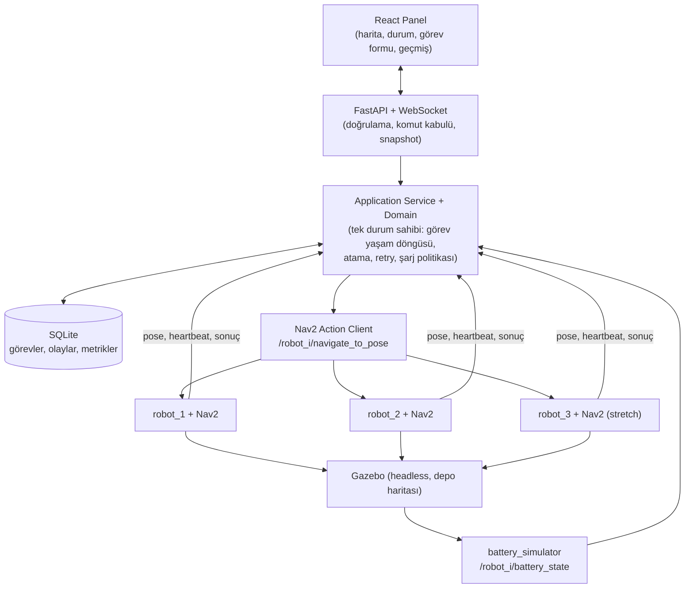
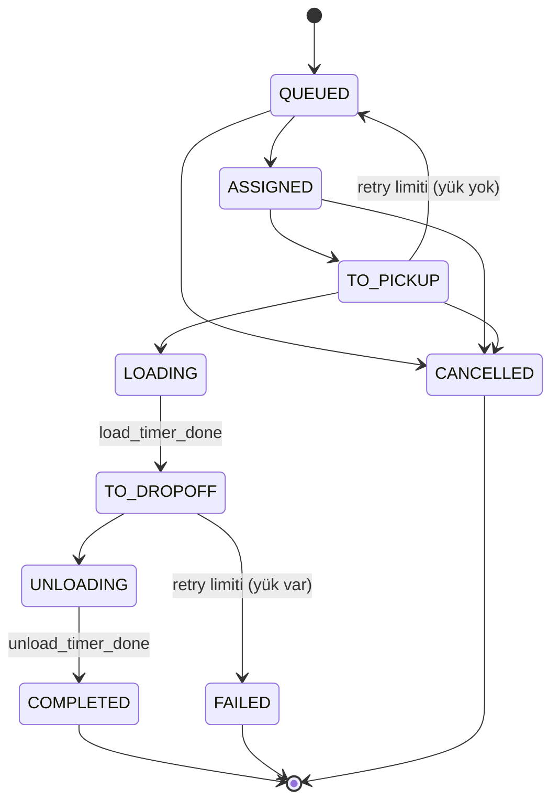

# ROS 2 Tabanlı Çok Robotlu Mini Filo Yönetim Sistemi

Simülasyon ortamında otomatik görev atama ve web tabanlı robot filo takibi.

> **Ders:** Yazılım Mühendisliği – Final Projesi
> **Platform:** ROS 2 Humble · Nav2 · Gazebo (Ignition Fortress) · FastAPI · SQLite · React
> **Mimari sürümü:** v2.0 (kilitlendi – 8 Ekim 2026)

---

## İçindekiler

1. [Proje Özeti](#1-proje-özeti)
2. [Hedefler ve Kapsam](#2-hedefler-ve-kapsam)
3. [Sistem Mimarisi](#3-sistem-mimarisi)
4. [Teknoloji Yığını](#4-teknoloji-yığını)
5. [Veri Modeli](#5-veri-modeli)
6. [Durum Makineleri](#6-durum-makineleri)
7. [Event ve Geçiş Tablosu](#7-event-ve-geçiş-tablosu)
8. [Enerji Tabanlı Atama](#8-enerji-tabanlı-atama)
9. [Batarya Simülasyonu ve Şarj](#9-batarya-simülasyonu-ve-şarj)
10. [Hata, Retry ve İptal Politikaları](#10-hata-retry-ve-iptal-politikaları)
11. [Restart Recovery ve Kalıcılık](#11-restart-recovery-ve-kalıcılık)
12. [Eşzamanlılık Modeli](#12-eşzamanlılık-modeli)
13. [Paket Yapısı](#13-paket-yapısı)
14. [Arayüzler](#14-arayüzler)
15. [Uygulama Planı](#15-uygulama-planı)
16. [Doğrulama ve Deneyler](#16-doğrulama-ve-deneyler)
17. [Kurulum ve Çalıştırma](#17-kurulum-ve-çalıştırma)
18. [Kapsam Dışı ve Gelecek Çalışma](#18-kapsam-dışı-ve-gelecek-çalışma)
19. [Ekip ve Lisans](#19-ekip-ve-lisans)

---

## 1. Proje Özeti

Depo veya hastane gibi iç mekânlarda çalışan birden fazla mobil robotun tek bir merkezden yönetilmesini sağlayan küçük ölçekli bir **filo yönetim sistemi (fleet management system)**.

Kullanıcı web panelinden bir **pickup → dropoff** teslimat görevi tanımlar (alım noktası, teslim noktası, öncelik). Sistem, robotların durumuna, konumuna ve enerji yeterliliğine bakarak görevi en uygun robota otomatik olarak atar ve ilerleyişi canlı olarak gösterir. Robotlar Gazebo simülasyonunda çalışır; her biri kendi Nav2 yığınıyla hedefe otonom olarak gider.

**Tasarımın omurgası**

| Bileşen | Sorumluluk |
|---|---|
| **Nav2** | Robotun verilen hedefe *nasıl* gideceğini çözer. |
| **Fleet Manager** | *Hangi robotun, hangi işi, ne zaman* yapacağını belirler. |
| **battery_simulator** | Enerji tüketimini ve fiziksel şarj koşullarını modeller. |
| **Domain katmanı** | İş kurallarını ROS, Nav2, Gazebo ve FastAPI'den bağımsız tutar. |

---

## 2. Hedefler ve Kapsam

### Kapsam seviyeleri

| Seviye | İçerik |
|---|---|
| **MVP** | 2 robot, pickup-dropoff görevleri, otomatik atama, görev kuyruğu ve geçmişi, web panelinde canlı durum/harita |
| **Stretch** | 3. robot, simüle batarya ve şarj istasyonu akışı, strateji karşılaştırma paneli |
| **Kapsam dışı** | 4+ robot, çok robotlu trafik/çarpışma önleme, gerçek donanım |

### Uygulama düzeyi

Tasarım üretim seviyesinde ayrıntılıdır; ders projesi kapsamında şu şekilde kademelendirilir:

| Düzey | İçerik |
|---|---|
| **Uygulanacak (çekirdek)** | Domain state machine'leri, enerji filtresi, 3 atama stratejisi, tek consumer'lı event/command kuyruğu, `goal_id` / `attempt_id` ile eski sonuçların elenmesi, SQLite event journal, retry politikası, `payload_state`, yük öncesi görev iptali, operatör çözümü (`ResolveIncident`) |
| **Sadeleştirilmiş** | Outbox yerine "journal + idempotent yeniden gönderim"; restart'ta tablo kurallarının doğrudan uygulanması; dock contact bilgisinin simülatörde bölge + hareketsizlik + yakınlık eşiğinden türetilmesi |
| **Gelecek çalışma** | İstasyon rezervasyonu, robot karantina mekanizması, koridor rezervasyonu, küresel optimum atama |

---

## 3. Sistem Mimarisi



**Katmanlar**

1. **React panel / dış istemci:** Görev oluşturma, iptal, durum ve deney sonuçları.
2. **FastAPI ve ROS servis adaptörleri:** İsteği doğrular, komut kuyruğuna yazar, snapshot sunar.
3. **Application Service + Domain:** Görev yaşam döngüsü, atama, retry ve şarj politikasının tek sahibi.
4. **Çıkış adaptörleri:** SQLite kayıtları, Nav2 hedefleri, durum yayınları, WebSocket.
5. **Robot başına Nav2 + telemetri:** Navigasyon sonuçları, pose, heartbeat ve `BatteryState` olay kuyruğuna döner.

**Çekirdek alt bileşenler**

- **Robot Registry:** Kimlik, son telemetri, kullanılabilirlik, aktif görev bağı.
- **Task Queue:** Öncelik ve oluşturulma zamanına göre bekleyen işler.
- **Assignment Engine:** Uygunluk filtresi + seçili strateji.
- **Charging Policy:** İç şarj operasyonları.
- **Metrics / History:** Görev süresi, bekleme süresi, başarısızlık, robot kullanım oranı.

**Tasarım ilkeleri**

- Domain içinde `rclpy`, ROS mesajı, Nav2, Gazebo veya FastAPI **import edilmez**. Adaptörler dış veriyi sade domain nesnelerine dönüştürür. Bu sayede state machine ve stratejiler simülasyon açmadan `pytest` ile test edilir.
- Fleet Manager Nav2'yi doğrudan sürmez; `NavigateToPose` action'ı ile hedef gönderir.
- Fleet Manager batarya seviyesini **hesaplamaz**; `battery_simulator` yayınlar.
- Robotlar ayrı namespace'te çalışır (`/robot_1/odom`, `/robot_1/scan`, `/robot_1/cmd_vel`, ...). Ortak `map_server` ve ortak `map` frame'i kullanılır.
- Lokalizasyon sadeleştirmesi: AMCL yerine Gazebo ground-truth pozundan `map→odom` yayınlanır (çok robotlu TF/CPU karmaşasını azaltır).
- Pickup/dropoff noktaları depodaki **adlandırılmış noktalardan** seçilir. Noktalar arası yol uzunlukları açılışta bir kez hesaplanıp matriste tutulur (atama sırasında her robot için ayrı planlama çağrısından kaçınılır ve deneyler tekrarlanabilir olur).

---

## 4. Teknoloji Yığını

| Katman | Teknoloji |
|---|---|
| Robotik | ROS 2 Humble, Nav2, `ros_gz_bridge` |
| Simülasyon | Gazebo (Ignition Fortress), headless, basit depo dünyası |
| Backend | Python, `rclpy`, FastAPI, WebSocket |
| Kalıcılık | SQLite (WAL, tek writer) |
| Frontend | React + Vite, harita için Leaflet (`CRS.Simple`) veya canvas |
| Altyapı | Ubuntu VM veya Docker Compose |
| Test | `pytest`, `launch_testing` |

Tüm bileşenler açık kaynaktır ve fiziksel donanım gerektirmez.

**Performans önlemleri:** headless Gazebo, kamerasız robot, düşük/orta frekanslı LiDAR, basit harita, RViz kapalı, düşük çözünürlüklü costmap, robot konumlarının 5–10 Hz yayınlanması, `use_sim_time` tutarlılığı.

---

## 5. Veri Modeli

| Nesne | Temel alanlar |
|---|---|
| **Task** | `id`, `pickup_pose`, `dropoff_pose`, `priority`, `state`, `assigned_robot_id`, `payload_state`, `stage_retry_count`, `requeue_count`, `created_at`, `started_at`, `completed_at`, `version` |
| **Robot** | `id`, `state`, `pose`, `battery_soc`, `usable_capacity_wh`, `active_task_id`, `last_seen`, `telemetry_at`, `nav_goal_id`, `charge_phase`, `error_reason` |
| **Event** | `event_id`, `type`, `robot_id`, `task_id`, `goal_id`, `attempt_id`, `manager_epoch`, `observed_at`, `payload` |
| **Command** | `command_id`, `request_id`, `type`, `payload`, `submitted_at` |
| **ChargeOperation** | `robot_id`, `station_id`, `phase`, `goal_id`, `deadline`, `retry_count` |

**Değişmez kurallar**

1. Bir robot aynı anda en fazla bir aktif teslimat taşır; bir görev en fazla bir robota bağlıdır.
2. Atama ve robot-görev bağı aynı veritabanı transaction'ında kaydedilir.
3. Teslimat aşamasının ana kaynağı `Task.state`'tir. `Robot.state` bunun operasyonel yansımasıdır; `OFFLINE`, `ERROR` ve şarj durumu ayrıca robotun kullanılabilirliğini belirler.
4. `COMPLETED`, `FAILED`, `CANCELLED` terminaldir; tekrar çalıştırma yeni görev veya açık recovery işlemi gerektirir.

**Yük durumu ayrı tutulur:** `payload_state = NONE | ONBOARD | UNKNOWN`. `load_timer_done` → `ONBOARD`; `unload_timer_done` → `NONE`. LOADING sırasında çökme gibi belirsizliklerde `UNKNOWN` kaydedilir. Görev `FAILED` olsa bile robotta yük kalabilir; bu durumda robot operatör çözümü olmadan `IDLE` olmaz.

---

## 6. Durum Makineleri

### Teslimat görevi



| Task aşaması | Robot yansıması | Geçiş koşulu |
|---|---|---|
| `QUEUED` | Bağlı robot yok | Uygun robot beklenir |
| `ASSIGNED` | `ASSIGNED` | Atama kalıcılaştırılmıştır |
| `TO_PICKUP` | `NAVIGATING_TO_PICKUP` | Pickup goal kabul edilmiştir |
| `LOADING` | `LOADING` | Pickup sonucu başarılıdır |
| `TO_DROPOFF` | `NAVIGATING_TO_DROPOFF` | Yükleme bitti; hedef gönderiliyor/aktif |
| `UNLOADING` | `UNLOADING` | Dropoff sonucu başarılıdır |
| `COMPLETED` | `IDLE` veya `CHARGING` | Boşaltma onayı ve şarj politikası |

`TO_DROPOFF` aşamasında `nav_phase = SENDING | ACTIVE | RETRY_WAIT` kullanılır; böylece goal gönderimi ile kabulü arasındaki süre ayrı task state üretmeden izlenir.

### Robot

Normal akış: `IDLE → ASSIGNED → NAVIGATING_TO_PICKUP → LOADING → NAVIGATING_TO_DROPOFF → UNLOADING → IDLE`

Bağımsız durumlar:

- **OFFLINE:** Başlangıç veya heartbeat kaybı. `OFFLINE → IDLE` yalnızca telemetri tazeyse, navigasyon uzlaştırılmışsa ve yük/hata engeli yoksa gerçekleşir.
- **ERROR:** İletişim olsa bile çözülmemiş hata veya yük belirsizliği. Operatör çözümü gerekir.
- **CHARGING:** `charge_phase = TO_STATION | DOCKING | CHARGING | RELEASING`. Gerçek şarj `BatteryState` ile doğrulanır; istasyona ulaşmak tek başına şarj sayılmaz.

`LOW_BATTERY` ayrı bir state değil, bir koşuldur; `REQUEUE` de bir state değil, görev üzerindeki bir işlemdir.

---

## 7. Event ve Geçiş Tablosu

| Event / kaynak | Koşul ve task etkisi | Robot / yan etki |
|---|---|---|
| `task_submitted` / API | Geçerli ve yeni `request_id` → `QUEUED` | DB kaydı; atama tetiklenir |
| `robot_selected` / engine | `QUEUED → ASSIGNED` | `IDLE → ASSIGNED`; pickup gönder |
| `goal_accepted(pickup)` / Nav2 | `ASSIGNED → TO_PICKUP` | `NAVIGATING_TO_PICKUP` |
| `goal_succeeded(pickup)` / Nav2 | `TO_PICKUP → LOADING` | `LOADING`; bloklamayan timer |
| `load_timer_done` / timer | `LOADING → TO_DROPOFF`; `ONBOARD` | Dropoff goal gönder |
| `goal_accepted(dropoff)` / Nav2 | `TO_DROPOFF` kalır; nav `ACTIVE` | `NAVIGATING_TO_DROPOFF` |
| `goal_succeeded(dropoff)` / Nav2 | `TO_DROPOFF → UNLOADING` | `UNLOADING`; timer başlat |
| `unload_timer_done` / timer | `UNLOADING → COMPLETED`; `NONE` | `IDLE` veya iç şarj operasyonu |
| `goal_rejected / aborted / timeout` | Aşama, yük ve denemeye göre retry | Eski goal kapatılmadan yenisi gönderilmez |
| `battery_low` / policy | Aktif görevde `charge_pending=true` | `IDLE` ise istasyona yönlendir |
| `battery_critical` / policy | Aktif görev güvenli durdurma / `FAILED` | `ERROR`; yük bağı korunur |
| `battery_recovered` / policy | SoC ≥ release ve şarj doğrulandı | Undock sonrası `IDLE` |
| `heartbeat_lost` / registry | Yüksüz: kontrollü requeue; yüklü/belirsiz: `FAILED` | `OFFLINE` |
| `task_cancel_requested` / API | Yük öncesi onaylı iptal → `CANCELLED` | Goal durması doğrulanır; sonra `IDLE` |
| `charge_goal_succeeded` / Nav2 | Teslimat task'ına etkisi yok | `DOCKING`; contact/şarj bekle |

`battery_low / critical / recovered` olayları, sürekli yayınlanan `BatteryState`'ten eşik geçişlerine göre Fleet Manager tarafından türetilir. `goal_id`, `attempt_id` ve `epoch` ile eşleşmeyen gecikmiş sonuçlar **uygulanmaz**. Yük sonrası iptal MVP'de reddedilir veya operatör çözümüne çevrilir.

---

## 8. Enerji Tabanlı Atama

### Enerji modeli

```
E_available = SoC * C_usable_wh
E_delivery  = k_empty  * d(robot, pickup)
            + k_loaded * d(pickup, dropoff)
            + P_aux * (t_drive + t_load + t_unload) / 3600
E_return    = k_empty * d(dropoff, charger) + P_aux * t_return / 3600
E_required  = (1 + uncertainty) * (E_delivery + E_return)

Uygunluk:   E_available - E_required > E_reserve
```

SoC 0–1 aralığındadır; `k` katsayıları Wh/m, `P_aux` W, mesafeler metre, süreler saniyedir. `k` yalnızca sürüş enerjisini kapsar (yardımcı güç iki kez sayılmaz). Geçerli yol bulunamaması veya bayat telemetri robotu uygunsuz yapar.

**Sayısal örnek (açıklama amaçlı):** %22 SoC × 200 Wh = 44 Wh mevcut. Teslimat + şarja dönüş = 26 + 10 = 36 Wh; %15 belirsizlikle 41,4 Wh. Kalan 2,6 Wh < 10 Wh rezerv → robot %22'de olmasına rağmen **göreve atanmaz**. `soft_low` filtresi enerji denkleminin yerine değil, ek bir işletim filtresi olarak çalışır.

### Atama algoritması

```text
assign(task):
  candidates = []
  for robot in registry:
    if not idle_online_fresh_empty(robot): continue
    if robot.soc <= soft_low: continue
    estimate = estimate_route_energy(robot, task)
    if not estimate.reachable: continue
    if robot.energy - estimate.required <= reserve: continue
    candidates.append((robot, estimate))
  selected = strategy.select(task, candidates)
  if selected is None: return KEEP_QUEUED
  transaction:
    recheck_availability_and_version(selected, task)
    bind_robot_and_task(); save_assignment_and_journal()
  dispatch_pickup_after_commit()
```

### Stratejiler

| Strateji | Seçim kuralı | Not |
|---|---|---|
| **Random** | Uygun adaylar arasından uniform seçim | Deney tabanı; seed kaydedilir |
| **Nearest** | `argmin d(robot, pickup)` | Toplam maliyeti görmez |
| **CostBased** | `argmin J(r, t)` | Enerji, süre ve yakınlığı dengeler |

```
J(r,t) = wd * d_pickup/D_ref
       + we * E_required/E_ref
       + wt * ETA_delivery/T_ref
       + wb * reserve/E_after

E_after = E_available - E_required
wd + we + wt + wb = 1,  weights >= 0
```

Örnek ağırlıklar: `wd=0,35; we=0,30; wt=0,20; wb=0,15` (deneylerle kalibre edilir). Tüm stratejiler **aynı uygun aday filtresini** kullanır. Eşit puanda `robot_id` ile deterministik bağ kırma uygulanır. Görev sırası: `priority` azalan, `created_at` artan; uzun bekleyenler için aging önerilir. Requeue sonrası cooldown ve limit sonsuz denemeyi engeller.

Arayüz: `select_robot(task, eligible_candidates, context) → robot_id | None`. Bu sürüm çevrimiçi greedy atamadır; küresel optimum garantisi vermez.

---

## 9. Batarya Simülasyonu ve Şarj

```
/robot_i/odom + map pose + dock_contact
              |
        battery_simulator
              |
     /robot_i/battery_state   (sensor_msgs/BatteryState)
              |
   Fleet Manager: enerji / şarj politikası
```

Simülatör Fleet Manager'dan "şarj oluyor" komutu **almaz**. İstasyon bölgesinde, hareketsiz ve contact doğrulanmış robot şarj edilir:

```text
charging = in_zone(pose) and stationary(v, omega) and stable_dock_contact
if charging:
    E = min(C_usable, E + eta_charge * P_charge * dt / 3600)
else:
    E = max(0, E - k_motion * distance - P_aux * dt / 3600)
publish BatteryState(percentage = E / C_usable, power_supply_status = physical_status)
```

| Parametre | Örnek | Politika |
|---|---|---|
| `soft_low` | 0,25 | Yeni iş alma; boşsa şarja git |
| `critical_low` | 0,08 | Acil durum; güvenli duruş ve `ERROR` |
| `charge_release` | 0,80 | Şarj oturumunu bitirme hedefi |
| safety reserve | 10 Wh | Enerji denklemindeki zorunlu pay |

- **Histerezis:** 0,25 altına inilince oturum başlar; 0,25 üstüne çıkmak yetmez, 0,80 hedefi beklenir.
- Aktif teslimatta `soft_low` görevi kesmez, `charge_pending` işaretler. Kritik eşik veya kalan rota için yetersiz enerji güvenlik politikasını tetikler.
- Contact kaybı, bayat batarya verisi veya dock timeout şarjın başarılı sayılmasını engeller.
- Zaman hesabı simülasyonda `/clock` ile tutarlıdır.
- Simülasyonda dock contact, Gazebo temas sensörü yerine bölge + hareketsizlik + yakınlık eşiğiyle türetilir.

---

## 10. Hata, Retry ve İptal Politikaları

| Durum | Politika |
|---|---|
| Pickup öncesi Nav2 hatası | Aynı hedefte sınırlı retry. Limitte robot `ERROR`, görev `QUEUED`; bağ kaldırılır; eski hedefin kapandığı doğrulanır. |
| Yükleme sırasında belirsizlik | `payload=UNKNOWN`; robot `ERROR`, görev `FAILED`. Otomatik başka robota atama yapılmaz. |
| Pickup sonrası navigasyon hatası | `ONBOARD` korunur. Aynı robot aynı dropoff hedefine retry. Limitte robot `ERROR`, görev `FAILED`. |
| Boşaltma sırasında hata | Bırakma doğrulanmıyorsa yük durumu korunur; `FAILED` ve operatör çözümü. |
| Heartbeat kaybı | Robot `OFFLINE`. Yüklü/belirsiz görev `FAILED`; yüksüz görev ancak eski yürütme durdurulunca requeue. |
| Pickup öncesi iptal | Goal cancel sonucu ve duruş doğrulanır; task `CANCELLED`. |
| Pickup sonrası iptal | MVP'de reddedilir; teslimat sürdürülür veya operatörce recovery. |
| Kritik batarya | Güvenli duruş, `ERROR`, aktif görev `FAILED`; payload kaydı korunur. |

```text
on_navigation_failure(event):
  if not matches_current_goal_and_epoch(event): return
  close_or_cancel_old_goal()
  if termination_unconfirmed(): hold_robot_for_operator(); return
  if retries < max_retries:
      schedule_retry(same_robot, same_target, backoff)
  elif payload == NONE and stage_before_loading:
      mark_robot_error(); requeue_with_budget(task)
  else:
      mark_robot_error(); fail_task_keep_payload_link()
```

Retry bütçesi örneği: `max_retries=2` (ilk deneme dahil aşama başına en fazla 3 girişim). Requeue sayacı ayrıdır; limit aşılırsa görev `FAILED` olur. Backoff timer ile uygulanır, callback içinde `sleep` kullanılmaz. **Timeout, robotun gerçekten durduğu anlamına gelmez**: önce cancel/terminal sonuç ve duruş kontrolü gerekir.

**Operatör çözümü:** `ERROR` veya yük belirsizliğindeki robot, `POST /robots/{id}/resolve` (`ResolveIncident` komutu) ile `incidents` kaydı kapatılarak yeniden kullanılabilir hale getirilir. Geliştirme/demo kolaylığı için ayrıca bir "simülasyon reset" komutu bulunur.

---

## 11. Restart Recovery ve Kalıcılık

Başlangıçta atama kapısı kapalıdır; tüm robotlar `OFFLINE` kabul edilir. Veritabanındaki görev aşaması, yük durumu ve eski Nav2 yürütmesi uzlaştırılmadan yeni hedef gönderilmez.

| DB'deki task | Recovery kararı |
|---|---|
| `QUEUED` | Korunur; uygun robot gelince atanabilir. |
| `ASSIGNED` / `TO_PICKUP` | Payload `NONE` ve eski goal durduğu doğrulanınca `QUEUED`. |
| `LOADING` | Yük belirsiz: `FAILED`; robot `ERROR`. |
| `TO_DROPOFF` | `FAILED`; `ONBOARD` bağı korunur. Operatör aynı robotla dropoff recovery başlatabilir. |
| `UNLOADING` | `FAILED`; bırakma durumu doğrulanır. Körlemesine tekrar pickup yapılmaz. |
| Terminal durumlar | Kayıt korunur; payload incident ayrıca korunur. |

Adımlar: **açılış kilidi → robot uzlaştırma → güvenli durdurma → recovery transaction → atamayı aç** (yalnızca uzlaştırılmış robotlar aday olur).

**SQLite:** `tasks`, `robots`, `task_events`, `commands`, `incidents` tabloları (outbox ileri aşamaya bırakılmıştır). Durum güncellemesi ve event journal tek transaction'da tutulur; tek writer, WAL modu, kısa transaction süreleri. DB transaction'ı ile ROS action gönderimi atomik değildir; yeniden gönderimde `goal_id` / `attempt_id` ve uzlaştırma kullanılır, "exactly once" varsayılmaz.

---

## 12. Eşzamanlılık Modeli

```
FastAPI event loop          ROS MultiThreadedExecutor
       |                              |
 Command Queue                   Event Queue
       +--------------+---------------+
                      v
        Tek Fleet Manager consumer
                      |
          Domain + SQLite transaction
                      |
              Effects / dispatch
              +-------+--------+
              v                v
        ROS dispatcher   Snapshot / WebSocket
```

- Domain durumunun **tek sahibi** consumer'dır; API ve ROS callback'leri paylaşılan nesneleri değiştirmez.
- API okumaları değişmez snapshot üzerinden yapılır; sonuç gerekiyorsa `request_id` ile future tamamlanır.
- Kuyruklar thread-safe ve bounded'dır. Pose/batarya gibi yüksek frekanslı telemetri robot başına son değerle birleştirilir; goal sonuçları ve kritik olaylar kaybedilmez.
- Command ve event kuyruğunda adil tüketim yapılır; timer/deadline olayları bloklamadan üretilir; ROS gönderimleri asenkron yürütülür.
- Mesaj zarfı: `event_id`, `task_id`, `robot_id`, `goal_id`, `attempt_id`, `manager_epoch`. Tekrarlanan API `request_id` aynı görevi döndürür.

---

## 13. Paket Yapısı

```
fleet_ws/src/
├── fleet_interfaces/        # msg/ + srv/ (ament_cmake)
├── fleet_manager/
│   ├── domain/              # models, states, events, rules (ROS bağımsız)
│   ├── application/         # services, recovery, charging
│   ├── assignment/          # base, random, nearest, cost_based
│   ├── ros_adapters/        # nav2, telemetry, services, publisher
│   ├── persistence/         # repositories, sqlite
│   ├── api/                 # routes, schemas, websocket
│   ├── config/              # policy ve strateji parametreleri
│   └── tests/               # domain, integration, recovery
├── battery_simulator/       # model, dock input, BatteryState
└── fleet_sim/               # world, URDF, launch, Nav2 parametreleri
frontend/                    # React + Vite (workspace dışında)
```

---

## 14. Arayüzler

Standart arayüzler kullanılır: `sensor_msgs/BatteryState`, `geometry_msgs/PoseStamped`, `nav2_msgs/action/NavigateToPose`. Özel mesajlar yalnızca filo kavramlarını kapsar.

| Arayüz | Alanlar / sonuç |
|---|---|
| `RobotStatus.msg` | `header`, `robot_id`, `state`, `charge_phase`, `battery_soc`, `pose`, `active_task_id`, `payload_state`, `error_reason` |
| `TaskStatus.msg` | `task_id`, `state`, pickup/dropoff `PoseStamped`, `assigned_robot_id`, `stage_retry_count`, `requeue_count`, `payload_state`, zamanlar, `version` |
| `SubmitTask.srv` | `request_id`, `pickup`, `dropoff`, `priority` → `accepted`, `task_id`, `reason` |
| `CancelTask.srv` | `request_id`, `task_id` → `accepted`, `reason` (accepted ≠ iptal tamamlandı) |
| `SetAssignmentStrategy.srv` | `strategy_name` → `accepted`, `active_strategy`, `reason` |
| `FleetStatus.msg` (opsiyonel) | `header`, `RobotStatus[]`, `TaskStatus[]` |

`uint8 state` alanları için enum sabitleri mesajda tanımlanır. `BatteryState.percentage` 0–1 ölçeğindedir; UI ×100 gösterir. NaN veya bayat veri uygunluk filtresinde reddedilir.

**HTTP uçları**

| Yöntem | Yol | Açıklama |
|---|---|---|
| `POST` | `/tasks` | Görev oluştur (HTTP 202 + `command_id`) |
| `POST` | `/tasks/{id}/cancel` | Görev iptal isteği |
| `GET` | `/tasks` | Görev listesi / geçmiş |
| `GET` | `/robots` | Robot durumları |
| `PUT` | `/assignment-strategy` | Atama stratejisini değiştir |
| `POST` | `/robots/{id}/resolve` | Operatör çözümü (incident kapat) |
| `WS` | `/ws/fleet` | Canlı filo durumu akışı |

Komut kabulü gerçek sonucu değil, kabul edildiğini bildirir; sonuç durum akışından izlenir. API ve ROS servisleri aynı komut modelini kullanır.

---

## 15. Uygulama Planı

1. **Saf domain:** modeller, geçiş kuralları, enerji filtresi, stratejiler (`pytest`).
2. **Kalıcılık ve kuyruk:** SQLite, event/command kuyruğu, restart recovery.
3. **Tek robot:** Nav2 ile pickup-dropoff ve timer akışı.
4. **Batarya:** `battery_simulator`, şarj akışı, kritik eşik.
5. **Çoklu robot:** namespace yapısı, 3 strateji, web paneli, deneyler.

Web paneli, ROS'a bağımlı kalmamak için 2. adımdan itibaren **mock API** ile paralel geliştirilebilir.

**Riskler**

- Çok robotlu Nav2 + Gazebo CPU'yu zorlar → headless, kamerasız robot, düşük çözünürlüklü costmap.
- Dar koridorlarda robotlar birbirini kilitleyebilir (çarpışma çözümü kapsam dışı) → geniş harita ve robotlara farklı bölgeler.

---

## 16. Doğrulama ve Deneyler

### Kabul senaryoları

| Senaryo | Beklenen sonuç |
|---|---|
| %22 batarya; enerji rezervi yetersiz | Atama reddedilir; görev `QUEUED` kalır. |
| Pickup öncesi 3 başarısız girişim | Robot `ERROR`; bütçe uygunsa görev requeue. |
| Pickup sonrası retry limiti | Aynı robot retry; limitte `FAILED`, yük bağı korunur. |
| Şarj bölgesinde temas olmadan duruş | Fiziksel şarj raporlanmaz. |
| Şarj oturumunda %26 → %79 → %80 | Oturum %80 hedefinden önce bırakılmaz. |
| `LOADING` / `TO_DROPOFF` sırasında restart | Görev `FAILED`; robot otomatik `IDLE` olmaz. |
| Eski goal sonucu ve tekrar API isteği | Yanlış geçiş veya çift görev oluşmaz. |
| Heartbeat kaybı; eski goal belirsiz | Robot atama dışı; körlemesine devir yapılmaz. |

### Strateji karşılaştırma protokolü

Random, Nearest ve CostBased için **aynı** harita, görev dizisi, başlangıç pose/SoC, enerji modeli ve istasyon kapasitesi kullanılır. Random için birden fazla seed denenir. Raporlanan metrikler: tamamlanma oranı, bekleme süresi, teslimat süresi, yol uzunluğu, Wh tüketimi, retry ve şarj sayısı. Nearest ve CostBased karşılaştırması yalnızca aynı uygun aday kümesiyle anlamlıdır.

> Eşikler ve katsayılar örnektir; deneylerle kalibre edilir.

---

## 17. Kurulum ve Çalıştırma

> **Taslak:** Paketler oluşturuldukça bu bölüm gerçek komutlarla güncellenecektir.

**Gereksinimler:** Ubuntu 22.04 (veya Docker), ROS 2 Humble, Nav2, Gazebo Ignition Fortress, `ros_gz`, Python 3.10+, Node.js (frontend için).

Planlanan akış:

1. Workspace'i derle (`colcon build` ile `fleet_ws`).
2. Simülasyonu ve Nav2'yi `fleet_sim` launch dosyasıyla başlat (headless).
3. `fleet_manager` ve `battery_simulator` düğümlerini başlat.
4. Web panelini (`frontend/`) çalıştır ve tarayıcıdan aç.
5. Tek komutla demo için Docker Compose kullan.

---

## 18. Kapsam Dışı ve Gelecek Çalışma

- 4 ve üzeri robot; gerçek donanım.
- Koridor rezervasyonu, çok robotlu trafik planlama, çarpışmasız ortak rota planlama (atama stratejisi tek başına bunları sağlamaz).
- Şarj istasyonu rezervasyonu ve kapasite yönetimi.
- Robot karantina mekanizması ve outbox deseni.
- Küresel optimum atama (bu sürüm çevrimiçi greedy atamadır).
- Gerçek BMS entegrasyonu (simülatör node'unun gerçek `BatteryState` topic'i ile değiştirilmesi).
- Türkçe/İngilizce çok dilli arayüz.

---

## 19. Ekip ve Lisans

- **Ekip:** _(doldurulacak)_
- **Lisans:** _(doldurulacak)_
